# Parallele Pragrammierung

## 1. Introduction

### 1. Performance Metrics (Speed-up...)

### 2. Amdahl’s Law and Consequences

- $T(p) = (1 - f) * T + \frac{f * T}{P}$

- Advantages - **Superlinear Speedup**
   1. More nodes = more memory = more memory bandwidth
   2. More parallelism = may be less work per process/task = may fit in cache
- Disadvantages
   1. Resource bottlenecks on a processor
   2. Contention in the network
   3. Multiple processes on one node
   4. Load imbalance

### 3. How to splip up, distribute and coordinate work?

### 4. Multiple Concurrent Executions

- Single Program Multiple Data (SPMD)
  - Limited orchestration overhead, explicit mapping of problem
  - Need to explicitly split data, possibility of load imbalance
- Manager/Worker
  - Simple approach, easy load balancing
  - Extra orchestration overhead, memory requirements (at manager), possibly more communication, scalability
- Pipelining
  - Use of specialized units
  - More communication, limited parallelism
- Arbitrary Task Dependencies
  - most parallelism exposed
  - Overhead, complicated dependencies

### Exercise -- Sequential Programming

1. Amdahl’s Law
2. Speedup & Parallel Efficiency
3. Race Conditions

## 2. Treading

1. Flynn’s Classification - (S/M)I(S/M)D
2. Hardware threads and Software threads
   - Hyperthreading / SMT
3. Fork/Join Model
4. The Linux Clone call (System Threads)
5. User-Level Threads
   - Advantages
      1. Easier to implement and support
      2. Lighter weight
   - Disadvantages
      1. No scheduling guarantees
      2. Preemption and progress is very hard to guarantee, if not impossible
      3. Often requires explicit `yield()` calls required
   - Use cases
      1. Light-weight, fine-grained task based parallel programming
      2. Closely coordinated activities with well-define switchpoints

- Thread creation and destruction can be expensive operations. Ensure large parallel regions or “park” threads.
- Locks are low-overhead when few threads try access them. Overhead grows with more threads accessing them more often.

### 1. The POSIX Thread API

1. Programming with pthreads

   ```c++
   #include <pthread.h>    // On some systems compile with „-lpthreads“
   #include <stdio.h>
   #include <stdlib.h>
   #include <assert.h>
   #define NUM_THREADS 5

   // void* pointer can pass and return all kinds of data
   void* perform_work(void* argument)
   {
      int passed_in_value;
      // turn argument in right data type
      passed_in_value = *((int*) argument);
      printf("Hello World! It's me, thread with argument 
               %d!\n", passed_in_value);
      return NULL;
   }

   int main(int argc, char** argv)
   {
      pthread_t threads[NUM_THREADS];
      int thread_args[NUM_THREADS];
      int result_code; 
      unsigned index; 
      // create all threads one by one
      for (index = 0; index < NUM_THREADS; ++index)
      {
         thread_args[index] = index;
         printf("In main: creating thread %d\n", index);
         result_code = pthread_create(&threads[index], NULL, perform_work, &thread_args[index]);
         assert(!result_code);
      }
      // wait for each thread to complete
      for (index = 0; index < NUM_THREADS; ++index)
      {
         // block until thread 'index' completes
         result_code = pthread_join(threads[index], NULL);
         assert(!result_code);
         printf("In main: thread %d has completed\n", index);
      }
      printf("In main: All threads completed successfully\n");
      exit(EXIT_SUCCESS);
   }
   ```

2. POSIX thread locks

   ```c++
   int account = 100;
   // Can also be done dynamically: pthread_mutex_init/destroy()
   pthread_mutex_t mutex = PTHREAD_MUTEX_INITIALIZER;

   void deposit(int money)
   {
      pthread_mutex_lock(&mutex);
      account = account + money;
      pthread_mutex_unlock(&mutex);
      return 0;
   }
   ```

   - Spin-locks and Yielding-locks
   - Lock granularity: coarse, fine and hybrid
   - Deadlocks

3. POSIX Threads - Details

   ```c++
   // Attributes
   // • Set of properties defining thread behavior
   // • Examples: bound/unbound, scheduling policy, …

   // Get own thread ID
   pthread_self()
   // Compare two thread IDs
   pthread_equal(t1,t2)
   // Run a particular function once in a process
   pthread_once(ctrl, fct)

   // Stack management
   // • Routines to set and get the stack size
   // • Routines to set and get the stack address
   ```

### 2. Modern Thread APIs

1. Language APIs can Simplify Usage (e.g., C++)

   ```c++
   #include <string>
   #include <iostream>
   #include <thread>

   // The function we want to execute on the new thread.
   void task1(std::string msg)
   {
      std::cout << "task1 says: " << msg;
   }

   int main()
   {
      // Constructs the new thread and runs it. Does not block.
      std::thread t1(task1, "Hello");

      // Do other things...

      // Join threads, blocks until completion
      t1.join();

      return 0;
   }
   ```

2. Get the return value from kernel

   ```c++
   #include <string>
   #include <iostream>
   #include <future>

   // The function we want to execute on the new thread.
   double task1(std::string msg)
   {
      std::cout << "task1 says: " << msg << std::endl;
      return 3.14; // return a double
   }

   int main()
   {
      // Constructs the new thread and runs it. Does not block.
      std::future<double> fut = std::async(task1, "Hello");

      // Do other things...

      double result = fut.get(); // get return of task1

      std::cout << "Result: " << result << std::endl;

      return 0;
   }
   ```

3. Mutex Example C++

   ```c++
   #include <iostream>
   #include <thread
   #include <mutex>
   std::mutex mtx;
   void print_thread_id (int id)
   {
      mtx.lock();
      std::cout << "thread #" << id << '\n';
      mtx.unlock();
   }

   int main ()
   {
   std::thread threads[10];  // spawn 10 threads
   for (int i=0; i<10; ++i)
   {
      threads[i] = std::thread(print_thread_id,i+1);
   }
   for (auto& th : threads)
   {
      th.join();
   }
   return 0;
   }
   ```

### Exercise -- C++ Threaded Programming

1. C++ Threads : Passing Data
   1. Pass by Pointer
   2. Pass by Reference
2. C++ Threads: Pitfalls: Use of freed memory / Race Condition
3. Work Distribution Pitfalls
   1. Undercounting
   2. Overcounting
4. Synchronization
   1. Mutexes
   2. Condition Variables
   3. Barriers (not covered)
   4. Semaphores (not covered)
5. dynamic scheduling

   ```c++
   std::tread treads[THREADS];
   int thread_args[THREADS];

   std::mutex global_end_mutex;
   int global_end = 1000;
   int workload = 5;

   void work_kernel(){
      while (true){
         if (global_end < 0){
            break;
         }

         global_end_mutex.lock();
         int i_end = global_end;
         global_end -= workload;
         global_end_mutex.unlock();
         int i_start = std::max(i_end-workload+1, 0);

         for (int i=i_end; i>i_start; i--){
            // ...
         }
      }
   }

   for (int index=0; index<THREADS; index++){
      theads[index] = std::thread(work_kernel);
   }

   for (int index=0; index<THREADS; index++){
      theads[index].join();
   }
   ```

### Exercise -- Thread pools

1. Problem
   1. Thread creation and destruction is expensive.
   2. Creating more threads than the hardware has available can cause significant overhead.
2. Idea
   - Create a certain amount of threads and reuse each thread once a task is finished.
3. Thread Pools - work queue - **conditional variable**:

   ```c++
   #include <deque>
   #include <mutex>
   #include <future>
   #include <condition_variable>

   class WorkQueue {
      public:
      void add_task(std::packaged_task<void()> task)
      {
         {
            // The mutex is automatically released (unlocked) when the 
            // std::lock_guard object goes out of scope, typically at the end 
            // of the block in which it is declared.
            std::lock_guard<std::mutex> lock(mutex);
            queue.push_back(task);
         }
         cv.notify_one();  // conditional variable
      }

      std::packaged_task<void()> get_task()
      {
         // 1. The mutex is automatically released when the std::unique_lock 
         // object goes out of scope, similar to std::lock_guard.
         // 2. It can also be explicitly locked and unlocked multiple times 
         // within its lifetime using its member functions lock() and unlock().
         std::unique_lock<std::mutex> lock(mutex);

         while (queue.empty() && !complete)
         {
            cv.wait (lock);  // conditional variable
         }
         if(queue.empty() && complete)
         {
                return emptyTask;
         }
         std::packaged_task<void()> task = queue.front();
         queue.pop_front();
         return task ;
      }

      bool empty()
      {
         return queue.empty ();
      }

      void markComplete()
      {
         complete = true;
         cv.notify_all();
      }

      private:
      std::deque<std::packaged_task<void()>> queue;
      std::function<void()> emptyTask = [](){};
      std::mutex mutex;
      std::condition_variable cv;
      bool complete = false;
   };
   ```

4. future

   ```c++
   #include <iostream>
   #include <future>

   // Function simulating a time-consuming task
   void asyncTask(std::promise<int>& prom) {
      // Simulate a time-consuming task
      std::this_thread::sleep_for(std::chrono::seconds(2));
      // Set the result of the async task
      prom.set_value(42);
   }

   int main() {
      // Create a promise object
      std::promise<int> prom;
      // Get the associated future object with the promise
      std::future<int> fut = prom.get_future();

      // Launch an asynchronous task using std::async
      std::future<void> asyncResult = std::async(std::launch::async, asyncTask,
                                                 std::ref(prom));

      // In the main thread, wait for the asynchronous task to finish
      std::cout << "Waiting for result..." << std::endl;
      asyncResult.wait(); // Wait for the async task to complete
      
      // Get the result of the async task
      int result = fut.get();
      std::cout << "Async task result: " << result << std::endl;

      return 0;
   }
   ```

## 3. OpenMP 1

### 1. OpenMP and its Execution Model

1. Pros and Cons of Using Pthreads
2. OpenMP is comprised of three primary API components
   -. Compiler Directives (for C/C++ and Fortran)
   -. Runtime Library Routines
   -. Environment Variables
3. OpenMP is not ...
   - intended for distributed memory systems
   - necessarily implemented identically by all vendors
   - guaranteed to automatically make the most efficient use of shared memory
   - required to check for data dependencies, race conditions, deadlocks, etc.
   - designed to handle parallel I/O
4. Fork/Join Execution Model of OpenMP
5. Nested Parallelism
6. Programmer responsibility
   - Ensure no loop dependencies exist
   - Ensure the right variables or private or shared
   - Ensure the necessary synchronization is added

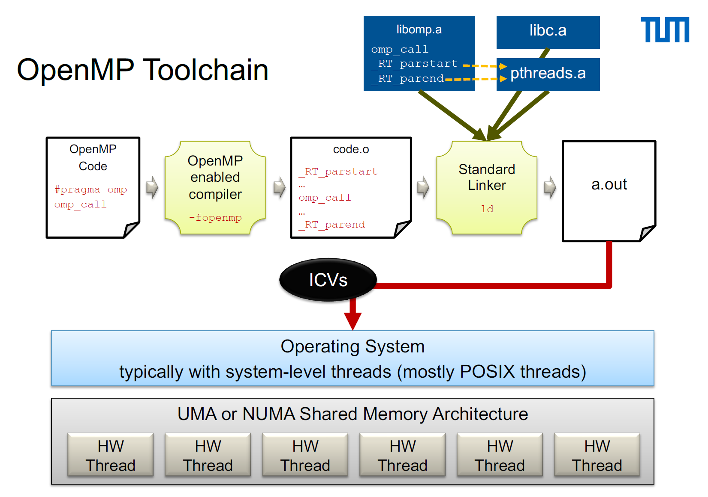

- Simple Example:

   ```c++
   #include <omp.h>
   int main(){
      #pragma omp parallel  // OMP_NUM_THREADS=2
      {
         printf("Hello world");  // print 2 times
      }
      return 0;
   }
   // compile with gcc -O3 -fopenmp openmp.c
   ```

### 2. OpenMP Syntax and Basics

1. structured block: { … }
2. Directives can have continuation lines:

   ```c++
   #pragma omp parallel private(i) \
      private(j)
   ```

3. Parallel Regions

   ```c++
   // Degree of parallelism controlled by ICV: OMP_NUM_THREADS
   #pragma omp parallel [parameters]
   {
      // block
   }
   ```

   We can set the num of threads for the parallel region.

   ```c++
   #pragma omp parallel num_threads(4)
   {
      // block
   }
   ```

4. Sections in a Parallel Region

   - Most “thread like” option must be within a parallel region.
   - Each section within a sections block is executed once by one thread.
   - Threads that finished their section wait at an **implicit barrier** at the end of the sections region/block.

   ```c++
   #pragma omp sections [parameters]
   {
      #pragma omp section
      { 
         // … block … 
      }
      #pragma omp section
      { 
         // … block … 
      }
      // ...
   }
   ```

   Example

   ```c++
   omp_set_nested(2);
   #pragma omp parallel
   {
      #pragma omp sections
      {
         #pragma omp section
         {
            #pragma omp parallel for
            for (i = 0 ; i < N ; i ++ ){
               D[i] = x * A[i] + x * B[i];
            }
         }
         #pragma omp section
         {
            #pragma omp parallel for
            for (i = 0 ; i < N ; i++){
               C[i] = c * A[i];
            }
         }
      }
   }
   ```

5. Parallel Loop

   - All threads of the team synchronize at an **implicit barrier**, unless the parameter `nowait` is specified.
      > Note: the expressions in the for-statement are very restricted

      ```c++
      // #pragma omp for [parameters]
      //   for ...

      int main() {
         int n = 100;
         int a[100];
         
         #pragma omp parallel
         {
            #pragma omp for
            for (int i = 1; i < n; i++) {
                  a[i] = i;
            }
         }
         
         return 0;
      }
      ```

   - SIMD for inner loop.

      ```c++
      #pragma omp simd
      {
         // block
      }
      ```

6. Loop Schedules

   - Defines how iterations are split up, leads to the creation of “Chunks”
   - Defines how chunks are mapped to threads
   - static, dynamic, guided, runtime, auto

   ```c++
   #define S 25

   int main(int argc, char** argv) {
       int a[S], b[S], c[S];
       
       #pragma omp parallel
       {
           #pragma omp for schedule(static)
           for (int i = 0; i < S; i++)
               a[i] = omp_get_thread_num();
           
           #pragma omp for schedule(dynamic, 4)
           for (int i = 0; i < S; i++)
               b[i] = omp_get_thread_num();
           
           #pragma omp for schedule(guided)
           for (int i = 0; i < S; i++)
               c[i] = omp_get_thread_num();
       }
       
       for (int i = 0; i < S; i++)
           printf("Iter %4d: %4d %4d %4d\n", i, a[i], b[i], c[i]);

       return 0;
   }
   ```

   1. Static
      - Static Scheduling: Iterations of the loop are divided into equal-sized chunks and distributed to threads in a round-robin manner. This division happens at the start of the parallel region.
      - Default Chunk Size: If no chunk size is specified, iterations are evenly divided among the threads.
      - Advantages: Low overhead because the division of work is done once before the loop starts.
      - Disadvantages: Can lead to load imbalance if the work within each iteration is not uniform.
   2. Dynamic
      - Dynamic Scheduling: Iterations are divided into chunks of a specified size (in this case, 4) and assigned to threads dynamically. When a thread finishes its chunk, it requests the next available chunk.
      - Chunk Size: Here, each thread gets 4 iterations at a time.
      - Advantages: Better load balancing for loops where the workload varies significantly between iterations.
      - Disadvantages: Higher overhead due to the need for threads to request new chunks during execution.
   3. Guided
      - Static Scheduling (schedule(static)): Best for loops where each iteration takes roughly the same amount of time. It minimizes overhead but can suffer from load imbalance.
      - Dynamic Scheduling (schedule(dynamic, 4)): Best for loops where the time taken for each iteration varies. It improves load balancing at the cost of higher overhead.
      - Guided Scheduling (schedule(guided)): Provides a balance between load balancing and overhead. It starts with larger chunks and reduces the chunk size as threads complete their work.
   4. Runtime
      - Controlled at runtime using control variable.
   5. Auto
      - Compiler/Runtime can choose.

7. Loop collapse

   - When writing nested loops, there are times when we would like to consolidate multiple loops into a larger one to improve code readability and performance.

   ```c++
   #pragma omp parallel for collapse(2)
   for (int i = 0; i < N; ++i) {
      for (int j = 0; j < M; ++j) {
         // operations
      }
   }
   ```

8. Data Sharing in OpenMP

   1. Shared: Accessible by all threads, one copy for all threads. (The default for global variables)
   2. Private: Accessible only by a single thread, each thread has its own copy.
   3. Local data: Variables declared within the “dynamic extent” of parallel regions. **Each thread has its own stack frame where local variables.**

   - Private clause for parallel loop:

   ```c++
   int main() {
      int a[100], t; 
      
      #pragma omp parallel
      {
         #pragma omp for private(t)
         // Variable t by default shared, but now “privatized”
         for (int i = 1; i < n; i++) {
               t = f(i);
               a[i] = t;
         }
      }
      
      return 0;
   }
   ```

   - Firstprivate: Each thread will have its own private copy of the variable initialized with the value it had before entering the parallel region.
   - Lastprivate: The value of the variable from the last iteration of the loop will be copied back to the original variable outside the loop.

   ```c++
   int i=3;
   // private(i): In OpenMP, when a variable is declared as private in a parallel region, each thread gets its own 
   // copy of the variable with an uninitialized value. These copies are completely separate from the original variable 
   // declared outside the parallel region.

   // firstprivate(i): This clause combines the behavior of the private and copyin clauses. At the beginning of the 
   // parallel region, each thread gets its own copy of i, and the original value of i (from the master thread) is 
   // copied  into each of these copies.

   // lastprivate(i): This clause specifies that the value of i from the last iteration of the loop (or sections) is copied 
   // back to the original i after the end of the parallel region.

   #pragma omp parallel for firstprivate(i) \  // initialize the inner i with the outer i = 3
                            lastprivate(i)     // pass the inner i value to outer i
   for (int j=0; j<4; j++)
   { 
      i=i+1;
      printf("-> i=%d\n", i); 
   }
   printf("Final Value of I=%d\n", i);
   ```

   - `private(var-list)`
   - `shared(var-list)`
   - `default(private | shared | none)`
   - `firstprivate(var-list)`
   - `lastprivate(var-list)`

9. Data Synchronization

   - Barrier: each thread waits until all other threads in the team have reached the barrier

      ```c++
      #pragma omp barrier
      ```

   - Master Region: only the master executes the code block
      - Other threads skip the region
      - No synchronization at the beginning of region

      ```c++
      #pragma omp master
         // block
      ```

   - Masked Region: declares a region that only the primary thread or the threads execute that are specified in the integer expression executes the code block
      - Other threads skip the region
      - No synchronization at the beginning of region

      ```c++
      #pragma omp masked // #pragma omp masked [filter(integer-expression)]
         // block
      ```

   - Single Region: enforces that only a (arbitrary) single thread executes the code block
     - Other threads skip the region
     - **Implicit barrier** synchronization at the end of region

      ```c++
      #pragma omp single [parameter]
         // block
      ```

   - Critical Section: a block of code can only be executed by only one thread at a time

      - A thread waits at the beginning of a critical section until its available
      - All unnamed critical directives map to the same name
      - Critical section names are global entities of the program
      - Avoid long critical sections for performance reasons

      ```c++
      #pragma omp critical [(Name)]
         // block
      ```

   - Atomic Statements: directive ensures that a specific memory location is updated atomically, equivalent to using critical section to protect the update

     - x binop= expr
     - x++ or ++x
     - x-- or --x

      ```c++
      #pragma omp atomic
         // expression-stmt
      ```

   - Simple Runtime Locks

      - Same concept as Pthread mutex
      - Locks can be held by only one thread at a time.
      - A lock is represented by a lock variable of type `omp_lock_t`.

      ```c++
      omp_init_lock(&lockvar)                // initialize a lock
      omp_destroy_lock(&lockvar)             // destroy a lock
      omp_set_lock(&lockvar)                 // set lock
      omp_unset_lock(&lockvar)               // free lock
      logicalvar = omp_test_lock(&lockvar)   // check lock and possibly set lock, returns 
                                             // true if lock was set by the executing thread.
      ```

      - Example - Simple Lock:

      ```c++
      #include <omp.h>

      int id;
      omp_lock_t lock;
      omp_init_lock(&lock);

      #pragma omp parallel shared(lock) private(id)
      {
         id = omp_get_thread_num();
         omp_set_lock(&lock);    // Only a single thread writes
         printf("My Thread num is: %d", id);
         omp_unset_lock(&lock);

         while (!omp_test_lock(&lock))
            other_work(id);      // Lock not obtained

         real_work(id);          // Lock obtained
         omp_unset_lock(&lock);  // Lock freed
      }

      omp_destroy_lock(&lock);
      ```

      - Nestable Locks: is similar to simple locks. But, nestable locks can be set multiple times by a single thread.
        1. Each set operation increments a lock counter
        2. Each unset operation decrements the lock counter
        3. If the lock counter is 0 after an unset operation, lock can be set by another thread

   - Ordered Construct: Ordered constructs are executed strictly in the order in which they would be executed in a sequential execution of the loop.
     - Must be within the dynamic extent of an omp for construct with an ordered clause

      ```c++
      // In every thread will the code segement 2 be executed with the same order: i=1 -> i=2 -> i=3 -> ...
      #pragma omp for ordered
      for (int i=0; i<N; i++) {
         // Code segment 1

         #pragma omp ordered
         {
            // Code segment 2
         }

         // Code segment 3
      }
      ```

   - Reductions: perform operations on results from all threads, aggregate results and make it available to primary thread

      - Variables must be shared scalars. **But in the reduction region they will be private in different threads!**
      - Operator is one of the following: `+`, `*`, `-`, `&`, `ˆ`, `|`, `&&`, `||`, `max`, `min`...
      - Reduction variable can only appear in statements with the following form:
        1. `x = x operator expr`
        2. `x binop= expr`
        3. `x++, ++x, x--, --x`

      ```c++
      // OMP_NUM_THREADS=4
      int a=0;
      #pragma omp parallel for reduction(+: a)
      for (int j=0; j<100; j++)
      {
         a = j;
      }
      printf("Final Value of a=%d\n", a);
      // Final value of a: 24 + 49 + 74 + 99 = 246
      ```

      ```c++
      // OMP_NUM_THREADS=4
      int a=0;
      #pragma omp parallel for reduction(+: a)
      for (int j=0; j<100; j++)
      {
         a += j;
      }
      printf("Final Value of a=%d\n", a);
      // Final value of a: 4950
      ```

      >Because in most cases, assuming static loop scheduling

### Exercise -- OpenMP 1

1. thread_local (lock-free):

   ```c++
   // thread_local is used to declare thread-local variables, which have their own copies for each thread. 
   // This means that each thread can independently modify and access the variable without affecting the 
   // copies in other threads.
   thread_local Integer partial_result{0};

   Integer mulInteger(const Integer &a, const Integer &b)
   {
      Integer result{0};
      #pragma omp parallel
      {
         partial_result = {0};
         #pragma omp single
         {
               for (size_t i = 0; i < a.size(); i++)
               {
                  #pragma omp task
                  {
                     partial_result = addInteger(mulShiftedInteger(b, a[i], i), partial_result);
                  }
               }
         }
         #pragma omp critical
         {
               result = addInteger(partial_result, result);
         }

      }
      return result;
   }
   ```

   ```c++
   Integer partial_result{0};

   Integer mulInteger(const Integer &a, const Integer &b)
   {
      Integer result{0};
      #pragma omp parallel firstprivate(partial_result)
      {
         partial_result = {0};
         #pragma omp single
         {
               for (size_t i = 0; i < a.size(); i++)
               {
                  #pragma omp task
                  {
                     partial_result = addInteger(mulShiftedInteger(b, a[i], i), partial_result);
                  }
               }
         }
         #pragma omp critical
         {
               result = addInteger(partial_result, result);
         }

      }
      return result;
   }
   ```

## 4. OpenMP 2

### 1. Correctness Issues in OpenMP

1. Data Races
   1. Read after Write
   2. Write after Read
   3. Write after Write
2. dependencies
   1. data dependencies
   2. Loop Dependencies
      - Loop Independent Dependencies
      - Loop Carried Dependencies
3. Aliasing
   1. Simple for individual variables
   2. Harder for pointers
   3. Really hard for C-style pointers

### 2. Loop Transformations

1. Loop Interchange
   1. If we only have independent dependencies.
   2. If the direction of all dependences is in a way that all updates are done in the same way despite reordering.
2. Loop Distribution / Loop Fission
   - The order of the new loops has to preserve the dependences among the statement sets.
   - It generates multiple parallel loops, thus decreasing granularity.
   - Barrier synchronization might be required between the generated loops.
3. Loop Fusion
   - increases granularity (possibly reduces overhead)
   - may eliminate the need for a barrier
   - can introduce loop carried dependencies
4. Loop Alignment

   ```c++
   int N = 10;
   int a[N], b[N], c[N]
   
   // Original code
   for(int i=1;i<N;i++)
   {
      a[i] = b[i] + 2;
      c[i] = a[i-1] * 2;
   }

   // Change a carried dependence into an independent dependence.
   fo(int i=0;i<N;i++)
   {
      if(i>0)
      {
         a[i] = b[i] + 2;
      }
      if(i<10)
      {
         c[i+1] = a[i] * 2;
      }
   }

   // First and last iteration can be peeled of:
   c[1] =  a[0] * 2; 
   fo(int i=1;i<N-1;i++)
   {
      a[i] = b[i] + 2;
      c[i+1] = a[i] * 2;
   }
   a[N] = b[N] + 2;
   ```

### 3. The OpenMP Memory Model

1. Two fundamental concepts
   1. Memory/Cache Coherency
   2. Memory Consistency
2. Relaxed Consistency Models
   1. Processor Consistency
   2. Weak Consistency
      1. Data operation
      2. Synchronization operation
   3. Release Consistency
3. Memory synchronization points (or flush points)
   1. Entry and exit of parallel regions
   2. Barriers (implicit and explicit)
   3. Entry and exit of critical regions
   4. Use of OpenMP runtime locks
   5. Every task scheduling point
4. OpenMP’s Flush Directive
   - Synchronizes data of the executing thread with main memory
   - If no list is specified, all shared variables accessible in the region

   ```c++
   #pragma omp flush [(list)]
   ```

   - Implementing Manual Synchronization

   ```c++
   // Thread 1
   a = foo();
   #pragma omp flush(a, flag)
   flag = 1;
   #pragma omp flush(flag)

   // Thread 2
   while(flag)
   {
      #pragma omp flush(flag)
   }
   #pragma omp flush(a, flag)
   b = a;
   ```

### 4. OpenMP Tasking

1. Drawbacks of Work Sharing
   1. Possible imbalance caused by workload
   2. Possible imbalance caused by machine
   3. Limited programming flexibility - Limited (in OpenMP) to for loops
2. Explicit Tasking
   - Main concept: users create tasks (Independent pieces of work)
   - OpenMP runtime system schedules the tasks as needed
   - Tied vs. Untied tasks

3. Tasking Syntax in OpenMP

   ```c++
   // Default data scoping attribute for task region is firstprivate
   #pragma omp task [clause list]{ ... }

   // Select clauses
   if (scalar-expression)  // FALSE: Execution starts immediately by the creating thread
   untied  // Task is not tied to the thread starting its execution
   Default (shared|none), private, firstprivate, shared  // Default is firstprivate.
   priority(value)  // Hint to influence order of execution
   final (scalar-expression)  
   // A task and all its subtasks become final tasks when the result of the final expression is true.
   // A final task is a special kind of task that cannot generate parallel tasks. This means that if 
   // a task is a final task, all tasks created within that task are executed immediately rather than 
   // being deferred for later. This can be used to control the level of task parallelism and prevent 
   // excessive parallelism from incurring undue overhead.
   ```

   >In an OpenMP task construct, all private variables defined outside the task block are implicitly firstprivate by default.

4. Explicit creation of tasks

   ```c++
   #pragma omp parallel
   {
      #pragma omp single
      {
         for (elem = l->first; elem; elem = elem->next)
         {
            #pragma omp task
            process(elem);
         }
      }
      // all tasks are complete by this point
   }
   ```

   Example: Traversal

   ```c++
   struct node {
      struct node *left;
      struct node *right;
   };

   void traverse(struct node *p) {
      if (p->left) {
         #pragma omp task // p is firstprivate by default
         traverse(p->left);
      }
      if (p->right) {
         #pragma omp task // p is firstprivate by default
         traverse(p->right);
      }
      process(p);
   }

   #pragma omp parallel
   {
      #pragma omp single
      {
         traverse(root);
      }
      // Implicit synchronization points 
      // Ensure that all tasks complete before exiting a parallel region
   }
   ```

5. Task Wait and Task Yield

   ```c++
   #pragma omp taskwait { ... }
   // Waits for completion of immediate child tasks
   // - Child tasks: Tasks generated since the beginning of the current task
   ```

   ```c++
   #pragma omp taskyield{ ... }
   // Explicit task scheduling point: The taskyield construct specifies that the current task can be suspended
   ```

   Implicit task scheduling points:
      - Task creation
      - End of a task
      - Taskwait
      - Barrier synchronization

6. Task Dependencies
   1. Out: variables produced by this task
   2. In: variables consumed by this task
   3. Inout: variables is both in and out

   ```c++
   #pragma omp task depend(dependency-type: list)
   { ... }

   // Example
   #pragma omp task shared(x, ...) depend(out: x) // T1
      preprocess_some_data(...);
   #pragma omp task shared(x, ...) depend(in: x) // T2
      do_something_with_data(...);
   #pragma omp task shared(x, ...) depend(in: x) // T3
      do_something_independent_with_data(...);
   ```

7. Performance Considerations for Task
   1. Advantages:
      - Implicit load balancing
      - Simple programming model
      - Many complications and bookkeeping pushed to runtime
   2. Consideration1: Task granularity
   3. Consideration2: NUMA optimization
  
### 5. OpenMP Wrapup

1. Important Runtime Routines

   ```c++
   // Determine the number of threads for parallel regions
   omp_set_num_threads(count)
   // Query the maximum number of threads for team creation
   numthreads = omp_get_max_threads()
   // Query number of threads in the current team
   numthreads = omp_get_num_threads()
   // Query own thread number (0..n-1)
   iam = omp_get_thread_num()
   // Query the number of processors
   numprocs = omp_get_num_procs()

   // Start nesting of parallel region
   omp_set_nested(2);

   // Returns the current wall clock time (in seconds).
   start_or_end_time = omp_get_wtime()
   // Returns the resolution of the current system timer.
   tick = omp_get_wtick()
   ```

2. Relevant Environment Variables (ICVs)

   ```c++
   // Number of threads in a team of a parallel region
   OMP_NUM_THREADS=4

   // Selects scheduling strategy to be applied at runtime
   // Schedule clause in the code takes precedence
   OMP_SCHEDULE=”dynamic” OMP_SCHEDULE=”GUIDED,4“

   // Allow runtime system to determine the number of threads
   OMP_DYNAMIC=TRUE

   // Allow nesting of parallel regions, if supported by the runtime
   OMP_NESTED=TRUE
   ```

### Exercise -- OpenMP 2

- Use affinity to realize the NUMA optimization

   ```c++
   #include <omp.h>
   #include <sched.h>
   #include <pthread.h>

   void set_thread_affinity(int thread_id) {
      cpu_set_t cpuset;
      CPU_ZERO(&cpuset);
      CPU_SET(thread_id % omp_get_num_procs(), &cpuset);
      pthread_setaffinity_np(pthread_self(), sizeof(cpu_set_t), &cpuset);
   }

   int main(int argc, char *argv[])
   {
      // Initialize OpenMP
      omp_set_num_threads(omp_get_max_threads());
      
      // Set thread affinity
      #pragma omp parallel
      {
         set_thread_affinity(omp_get_thread_num());
      }

      return 0;
   }
   ```

## 5. Shared Memory Performance

### 1. Synchronization Overhead

1. Good Locking Behavior
   - Only use locks when needed
   - Reduce time spent in locks
   - Carefully order lock usage to avoid deadlocks
   - If critical sections have to be substantial, try overlapping

2. Lock-free data structures
   1. Avoid use of mutex/critical sections
   2. Carefully manipulate memory to avoid bad “intermediate” state
   3. Hardware support essential
      - Compare and swap is common
      - Compare two values and only write new value if compare succeeds
      - Example: **Linked List. ABA Problem**

### 2. Cache Behavior and Locality

1. Improving cache performance is critical for sequential code, situation even worse in parallel case
   - More threads need bandwidth,
   - More pressure on caches
   - Contention on main memory

2. Problem of false sharing
   - Alignment and independent OMP parallel cache-line chunks can have big impact
   - Improving Data Locality

### 3. Thread and Data Locality / Mapping

1. Placing Memory
   - Typical policy: first touch
     1. Allocation only creates virtual space
     2. First access allocates physical memory
     3. Memory located close to accessing thread
     4. No later migration
   - Consequences
     1. Initialization determines locality, so use a parallel loop to initialize memory
     2. Prevent threads from migrating later
     3. Memory placement granularity is pages
   - Example(see lecture)

   Example: Stencil code

   ```c++
   #define N 5000
   #define ITER 100

   double A[N+2][N+2];

   int main() {
      // Memory located close to accessing thread
      #pragma omp parallel for
      for (int i = 0; i < N+2; i++) {
         for (int j = 0; j < N+2; j++) {
               A[i][j] = 0.0;
         }
      }

      for (int i = 0; i < N+2; i++) {
         A[i][0] = 1.0;
      }
      for (int i = 0; i < N+2; i++) {
         A[i][N+2] = 1.0;
      }

      // Iteration
      for (int n = 0; n < 100; n++) {
         #pragma omp parallel for
         for (int i = 1; i < N+1; i++) {
            for (int j = 1; j < N+1; j++) {
               A[i][j] = (A[i+1][j] + A[i-1][j] + A[i][j-1] + A[i][j+1]) / 4.0;
            }
         }
      }

      return 0;
   }
   ```

2. Thread Locations in OpenMP

   ```c++
   OMP_PROC_BIND  // ICV
   // true: threads are bound to cores/hw-threads
   // false: threads are not bound and can be migrated
   // master: new threads are always co-located with master
   // close: new threads are located “close” to their master threads
   // spread: new threads are spread out as much as possible

   OMP_PLACES     // ICV
   // Describes ordered list and hierarchy of all available hardware threads
   // Example: {0:4}, {4:4}, {8:4}, {12:4}
   // Master thread executes on first place
   ```

3. NUMA Management via libnuma
   - Routines to influence thread location
   - Routines to influence data location

   ```c++
   // Memory allocation
   - void *numa_alloc_onnode(size_t size, int node);
   - void *numa_alloc_local(size_t size);
   // Thread binding
   - void numa_bind(struct bitmask *nodemask);
   // Query routines
   - int numa_num_configured_nodes();
   ```

### 4. Scaling Systems

1. UMA - Central memory system becoms the main bottleneck
2. NUMA - Can't scale because of CC protocol
3. Alternative: Distributed Memory

## 6. SIMD (Single Instruction, Multiple Data)

### 1. SIMD instructions

```c++
// Load and store operations transfer data from memory/caches to the registers
vmov{a,u}ps dest, *mem
// Simple arithmetic
vaddps dest, source1, source2
// Two operations(e.g., multiply & add) fused into one SIMD instruction
vfmadd213ps source1, source2, source3
// Mask register limit effects of instructions to a subset of the SIMD elements
vaddps dest{k1}, source1, source2
// Assign a scalar value to all SIMD elements
vbroadcast dest, scalar
// Modify data layout in the SIMD register: shuffles, swizzles, blends
vpermilpd dest, source, imm
// Inter-lane permutes
vperm2f128 dest, source1, source2, 1
```

### 2. SIMD intrinsics

- Example:

   ```c++
   #include <immintrin.h>
   static inline
   _m256d register_rotate_256d(_m256d a){
      _m256d b, c;

      b = _mm256_permute_pd(a, 5);

      c = _mm256_permute2f128_pd(b, b, 1);

      return c;
   }
   ```

- AVX SIMD Data Types

   ```c++
   _m256    // a vector of 8 float entries
   _m256d   // a vector of 4 double entries
   _m256i   // a vector of 4 longs (or 8 int, ...)
   // pd: packed double
   // ps: packed single
   // sd: scalar double
   // ss: scalar single
   ```

- SIMDifying saxpy
  
   ```c++
   // Regular implementation
   void saxpy(float* y, float* x, float a, int n) {
      for (int i = 0; i < n; ++i) {
         y[i] = a * x[i] + y[i];
      }
   }

   // SIMD implementation
   void saxpy_simd(float* y, float* x, float a, int n) {
      int ub = n - (n % 8);  // 8 floats per SIMD register
      __m256 vy, vx, va, tmp;
      va = _mm256_set1_ps(a);
      for (int i = 0; i < ub; i += 8) {
         vy = _mm256_loadu_ps(&y[i]);
         vx = _mm256_loadu_ps(&x[i]);
         tmp = _mm256_mul_ps(va, vx);
         vy = _mm256_add_ps(tmp, vy);
         _mm256_storeu_ps(&y[i], vy);
      }

      // Remainder loop with mask
      __mmask8 m;
      m = (1 << (minint(ub+8, n) - ub)) - 1;
      vy = _mm256_mask_loadu_ps(vy, m, &y[ub]);
      vx = _mm256_mask_loadu_ps(vx, m, &x[ub]);
      tmp = _mm256_mask_mul_ps(va, m, va, vx);
      vy = _mm256_mask_add_ps(vy, m, tmp, vy);
      _mm256_mask_storeu_ps(&y[ub], m, vy);
   }
   ```

- Vectorization Efficiency

  - Corresponds to the average utilization of SIMD registers for a loop.
  - Defined as(N: trip count, vl: vector length): $VE = \frac{N/vl}{[N/vl]}$

### 3. High-level SIMD programming

- Compilers offer auto-vectorization as an opimization pass
- Example

  1. clang/LLVM-based compilers
     - `-fvectorize`
     - `-mprefer-vector-width=\<width\>`
  2. GCC
     - `-ftree-vectorize`
     - `-ftree-loop-vectorize`, `-ftree-slp-vectorize`(enabled with `-O3`)
- Why auto-vectorizers fail
  - Data dependencies
  - Other potential reasons
    - Alignment
    - Function calls in loop block
    - Complex control flow/conditional branches
    - Loop not "countable'
      - e.g. upper bound not a runtime constant
    - Mixed data types
    - Non-unit stride between elements
    - Loop body too complex (register pressure)
    - Vectorization seems inefficient
  - Many more ... but less likely to occur

- Data dependencies and Loop-carried dependencies

   ```c++
   void lcd_ex(float* a, float* b, size_t n, float c1, float c2) {
      for (size_t i = 0; i < n; ++i) {
         a[i] = c1 * a[i + 17] + c2 * b[i];
      }
   }
   // Parallelization: no
   // (except for very specific loop schedules)

   // Vectorization: yes
   // (if vector length is shorter than the distances of any loop-carried dependence)
   ```

### 4. OpenMP SIMD programming

- Vectorize a loop nest
  
   ```c++
   #pragma omp simd [clause[[,] clause], ...]
   // for-loops
 
   // SIMD loop clauses
   safelen(length)  // Maximum number of iterations that can run concurrently without breaking a dependence
                    // In practice, maximum vector length
   linear(list[:linear-step])  // The variable's value is in relationship with the iteration number
                               // x[i] = x[orig] + i * linear-step
   aligned(list[:alignment])  // Specifies that the list items have a given alignment
                              // Default is alignment for the architecture 
   collapse(n)

   // - Cut loop into chunks that fit a SIMD vector register
   // - No parallelization of the loop body
   ```

   ```c++
   // Example
   float sprod(float* a, float* b, int n) {
      float sum = 0.0f;
   #pragma omp simd reduction(+:sum)
      for (int k = 0; k < n; ++k) {
         sum += a[k] * b[k];
      }
      return sum;
   }
   ```

- Parallelize and vectorize a loop nest

   ```c++
   // First parallelize in many threads, then every thread will vectorize its work.
   // The vectorization will possibly cause remainder loop and peel loop
   #pragma omp parallel for simd [clause[[,] clause], ...]
   // for-loops
   ```

   ```c++
   // Example
   float sprod(float* a, float* b, int n) {
      float sum = 0.0f;
      #pragma omp parallel for simd reduction(+:sum) schedule(static, 5)
      for (int k = 0; k < n; ++k) {
         sum += a[k] * b[k];
      }
      return sum;
   }
   // We should choose chunk sizes taht are multiples of the SIMD length, because remainder loops are not
   // triggered, and therefore we will likely get better performance.

   // In the above example:
   // AVX2(8-wide), the code will only execute the remainder loop!
   // SSE(4-wide), the code will have one iteration in the SIMD loop plus one in the remainder loop!
   ```

- SIMD function vectorization

   ```c++
   // Declare one or more functions to be compiled for calls from a SIMD-parallel loop
   #pragma omp declare simd [clause[[,] clause], ...]
   // function-definition-or-declaration

   // Clauses
   simdlen(length)  // Generate function to support a given vector length
   uniform(argument-list)  // Argument has a constant value between the iterations of a given loop
   inbranch  // Optimize for function always called from inside an if-statement
   notinbranch  // Optimize for function never called from inside an if-statement
   linear(argument-list[:linear-step])
   aligned(argument-list[:alignment])
   ```

   ```c++
   // Example
   #pragma omp declare simd
   float min(float a, float b) {
      return a < b ? a : b;
   }

   #pragma omp declare simd
   float distsq(float x, float y) {
      return (x - y) * (x - y);
   }

   void example() {
      #pragma omp parallel for simd
      for (int i = 0; i < N; i++) {
         d[i] = min(distsq(a[i], b[i]), c[i]);
      }
   }
   ```

### Exercise -- SIMD

- [Intel Intrinsics Guide](https://www.intel.com/content/www/us/en/docs/intrinsics-guide/index.html)

- Simple Example

   ```c++
   // Regular implementation
   #include <stdlib.h>
   #include <stdint.h>
   #include <stdio.h>

   int main() {
      int size = 20000;
      int iterations = 100000;
      uint32_t* a = (uint32_t*)malloc(size * sizeof(uint32_t));
      
      for (int i = 0; i < size; ++i) a[i] = i;
      
      for (int iter = 0; iter < iterations; ++iter) {
         for (int i = 0; i < size; ++i) {
               a[i] = ((a[i] * a[i]) >> 1) ^ a[i];
         }
      }

      uint32_t sum = 0;
      for (int i = 0; i < size; ++i) sum += a[i];
      printf("%x\n", sum);
      
      free(a); // Don't forget to free the allocated memory!
      return 0;
   }
   ```

   ```c++
   // Implementation with intrinsic function
   #include <stdlib.h>
   #include <stdint.h>
   #include <stdio.h>
   #include <immintrin.h>

   int main() {
      int size = 20000;
      int iterations = 100000;
      uint32_t* a = (uint32_t*)aligned_alloc(16, size * sizeof(uint32_t));
      
      for (int i = 0; i < size; ++i) a[i] = i;
      
      for (int iter = 0; iter < iterations; ++iter) {
         for (int i = 0; i < size; i += 4) {
               __m128i* a_ptr = (__m128i*)(a + i);
               __m128i a_i = _mm_load_si128(a_ptr);
               __m128i mul = _mm_mullo_epi32(a_i, a_1i);
               __m128i srl = _mm_srli_epi32(mul, 1);
               __m128i xor = _mm_xor_si128(srl, a_i);
               _mm_store_si128(a_ptr, xor);
         }
      }

      uint32_t sum = 0;
      for (int i = 0; i < size; ++i) sum += a[i];
      printf("%x\n", sum);
      
      free(a); // Don't forget to free the allocated memory!
      return 0;
   }
   ```

### Exercise -- Shared Memory Review

## 7. MPI 1

### 1. Scaling systems and distributed memory systems

- Parallel Systems:
  - SIMD
  - MIMD
    - Distributed Memory (MPI)
      - MMP
      - Cluster
      - NOW
    - Shared Memory (Pthreads, OpenMP)
      - UMA
      - NUMA

### 2. Programming dist. memory systems

- Target: Distributed Memory / Shared Nothing Architectures
  - Need to split work into independent pieces
  - Each piece must be it’s own separate program / processes / individual threads

1. Carve up “shared” data structures
   - Each process must have its local data
   - Avoid or duplicate data needed by more
2. Allocate data elements locally
   - Independent allocations with own addresses
   - Need for local addressing
   - Avoid central initialization
3. Add explicit communication
   - Exchange of data
   - Synchronization

- Create a “Logical” Topology
   1. Arrange data items as needed
      - Define base elements
      - Create mapping of element to processes
   2. Create “logical topology”
      - Establish overlap, e.g., **halos**
      - Define neighborhood information
      - Establish communication direction
   3. Understand frequency of needed communication
   4. Often helpful to establish local coordinates
      - Extract from process number information
   5. Often helpful to explicitly define neighbors
      - Option 1: calculate or deduce neighbors
      - Option 2: active data exchange

### 3. A first MPI example

1. MPI Process vs. (OS) Process vs. Rank

2. A First Simple Example: Value Forwarding

   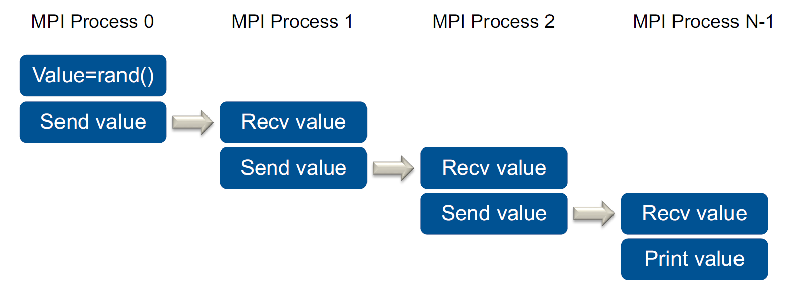

   ```c++
   #include <stdio.h>
   #include <stdlib.h>
   #include <mpi.h>

   int main(int argc, char** argv) {
      double value;
      int size, rank;

      // MPI_Status is a structure that includes the following fields:
      //    MPI_SOURCE: sender of the message
      //    MPI_TAG: message tag
      //    MPI_ERROR: error code
      MPI_Status s;
      // The actual length of the received message can be determined via:
      // int MPI_Get_count(const MPI_Status *status, MPI_Datatype dtype, int *count)

      // Initializes the MPI library
      MPI_Init(&argc, &argv);

      // MPI_COMM_WORLD: all initial MPI processes
      // MPI_COMM_SELF: contains only the own MPI process
      MPI_Comm_size(MPI_COMM_WORLD, &size);  // Returns the number of processes in the process group of the given communicator                              
      MPI_Comm_rank(MPI_COMM_WORLD, &rank);  //  Returns the rank of the executing process relative to the communicator

      
      value = MPI_Wtime();  // double MPI_Wtime(void): Return wall clock time since a reference time stamp in the past
                            // double MPI_Wtick(void): Returns resolution of MPI_Wtime
      printf("MPI Process %d of %d (value=%f)\n", rank, size, value);

      if (rank > 0)
         // int MPI_Recv (void *buf, int count, MPI_Datatype dtype, int source, int tag, MPI_Comm comm, MPI_Status *status)
         // Blocking receive of a message, until a matching message has been received
         // Note: possibilities of deadlocks (!)
         MPI_Recv(&value, 1, MPI_DOUBLE, rank - 1, 0, MPI_COMM_WORLD, &s);
         // MPI_ANY_SOURCE: Sender can be specified as wild cards
         // MPI_ANY_TAG: Tag can be specified as wild cards
         // There is no wild card for the communicator/context

      if (rank < size - 1)
         // int MPI_Send (void *buf, int count, MPI_Datatype dtype, int dest, int tag, MPI_Comm comm)
         // Initiates message send and blocks until send buffer can be reused
         // Note: possibilities of deadlocks (!)
         MPI_Send(&value, 1, MPI_DOUBLE, rank + 1, 0, MPI_COMM_WORLD);

      if (rank == size - 1)
         printf("Value from MPI Process 0: %f\n", value);

      // Finishes the use of MPI and releases all resources
      // Has to be called by all MPI processes and is collective
      MPI_Finalize();
      return 0;
   }
   ```

3. Compiling and Running

   - Compile: `…/ParProg> mpicc-openmpi-mp forw.c -o forw`
     - Most MPI implementation provide wrapper that set includes and libraries
   - Run: `…/ParProg> mpirun-openmpi-mp -np 4 --oversubscribe forw`
     - Most MPI implementations provide a run command
     - Often following suggestions in the standard
     - Common parameter `–np 4` (or `–n 4`)
   - Oversubscription in this case needed for run on one laptop

4. MPI Toolchain:  


## 8. MPI 2

### 1. Introduction Collectives

- Collective vs P2P operations vs One-sided

- Properties of Collective Operations
  - Must be executed by all processes of the communicator
  - Must be executed in the same sequence
  - Arguments across all MPI processes must be consistent (or equal)

- MPI provides three classes of collective operations
   1. Synchronization
      - Barrier
   2. Communication, e.g.,
      - Broadcast
      - Gather
      - Scatter
   3. Reduction, e.g.,
      - Global value returned to one or all processes.
      - Combination with subsequent scatter.
      - Parallel prefix operations

1. MPI_Barrier

   This operation synchronizes all MPI processes, i.e., no MPI process can return from the call until all MPI processes have called it.

   ```c++
   #include "mpi.h"
   main (int argc,char *argv[]){
      // ...
      MPI_Comm_size(MPI_COMM_WORLD, &np);
      MPI_Comm_rank(MPI_COMM_WORLD, &myid);

      // int MPI_Barrier (MPI_Comm comm)
      MPI_Barrier(MPI_COMM_WORLD);
      // ...
   }
   ```

2. MPI_Bcast

   The contents of the send buffer is copied to all other MPI processes.

   ```c++
   // int MPI_Bcast (void *buf, int count, MPI_Datatype dtype, int root, MPI_Comm comm)
   // IN buf: Adress of send/receive buffer
   // IN root: Rank of send/broadcasting MPI process
   switch (rank) {
   case 0:
      MPI_Bcast (buf1, ct, tp, 0, comm);  // send
      MPI_Send (buf2, ct, tp, 1, tag, comm);
      break;
   case 1:
      MPI_Recv (buf2, ct, tp, MPI_ANY_SOURCE, tag, ...);
      MPI_Bcast (buf1, ct, tp, 0, comm);
      MPI_Recv (buf2, ct, tp, MPI_ANY_SOURCE, tag, ...);
      break;
   case 2:
      MPI_Send (buf2, ct, tp, 1, tag, comm);
      MPI_Bcast (buf1, ct, tp, 0, comm);  // receive
      break;
   }
   ```

### 2. Communicators

- Central concept in MPI: Communicators
  1. Group of MPI processes
  2. Communication context
- Any communication operations is done in the context of a communicator
  - Argument to many functions
  - Addressing is relative to a communicator
    - Each process has a rank in a communicator
    - Ranks go from 0 to N-1 are fixed
    - A process can have different ranks in different communicators
  - Communication across communicators are not possible
    - Different context
    - But: one MPI process can be in multiple communicators

1. Creating New Communicators
   1. Typical strategy for libraries
      - Libraries get a communicator passed at initialization (often WORLD)
      - The library then clones the communicator and stores the handle

      ```c++
      // Default Communicators:
      // MPI_COMM_WORLD
      // MPI_COMM_SELF

      int MPI_Comm_dup(MPI_Comm comm, MPI_Comm *newcomm)
      // IN comm: communicator (handle)
      // OUT newcomm: copy of comm (handle)
      ```

   2. Communicators should be freed, when no longer in use

      ```c++
      int MPI_Comm_free(MPI_Comm *comm)
      ```

2. Creating Subcommunicators

   ```c++
   int MPI_Comm_split(MPI_Comm comm, int color, int key, MPI_Comm *newcomm)
   // IN comm:       Parent communicator
   // IN color:      All MPI processes that pass the same color, will be in same new communicator
   // IN key:        Key to determine rank order in new communicator
   // OUT newcomm:   New communicator
   ```

   - Pass `MPI_UNDEFINED` as color  
   - Will return `MPI_COMM_NULL` as new communicator

3. Example: Row and Column Communicators

   ```c++
   int rank, size, col, row;
   MPI_Comm row_comm, col_comm;

   MPI_Comm_size (MPI_COMM_WORLD, &size);
   MPI_Comm_rank (MPI_COMM_WORLD, &rank);

   Row = rank % N;
   Col = rank / N;

   MPI_Comm_split(MPI_COMM_WORLD, row, col, &row_comm);
   MPI_Comm_split(MPI_COMM_WORLD, col, row, &col_comm);
   // ...

   MPI_Bcast(buf, 1, MPI_INT, 0, col_comm);
   // (works also for Send & Recv)
   ```

   

### 3. Working with Tooling

1. Compiler Wrapper: `$ mpicxx -o exampleProgram exampleProgram.cpp`  
Sets relevant compiler and linker flags correctly so you don’t have to do it.
2. Runtime Helper: `$ mpirun ./exampleProgram`  
   1. Wrapper starts all the requested processes on all machines (e.g. via ssh/SLURM and **Hostfile**) and allocates ranks.  
   2. Some MPI implementations can use shared memory as a backend to transfer messages.  
   3. Flag `-np <num processes>` to specify the number of mpi processes.  
3. Debugging
   1. `printf();`
   2. `mpirun -n 4 gdb -ex=r -ex=bt -args ./program`
   3. There are also commercial MPI debuggers (e.g., totalview) and a plugin for Eclipse called Parallel Tools Platform (PTP)
4. Profiling
   1. MPI-P (uses PMPI)
   2. Vampir
   3. Valgrind

### 4. MPI Forum

- MPI Principles
   1. MPI is an API specification, no ABI.
   2. MPI is implemented as a library.
   3. MPI doesn't define runtime and environment interactions.
   4. MPI doesn't define a protocol.

1. History of the Message Passing Interface
2. [The MPI Forum Drives MPI](https://www.mpi-forum.org/)
3. Typical Way New Features Get Added to MPI

### 5. HPC Systems

### 6. HPC Facilities

- Double floors for easier installation, Cooling infrastructure...
- Why Is the Infrastructure Important?

### 7. HPC Applications and Scaling

1. Wide Range of HPC Application Spaces
2. Types of Scaling (changes in the number HW threads used)
   1. Weak Scaling
      1. Larger machine -> larger problem
      2. Assumptions
         - Machines are never big enough
         - Fully loading a node/core/HW thread is the right thing to do
      3. Advantages and Challenges
      4. Traditionally most common way to deal with scaling in HPC
   2. Strong Scaling
      1. Larger machine -> (hopefully) faster execution
      2. Assumptions:
         - The machine is big enough for the problem
         - Goal: reducing time to solution and increasing throughput
      3. Advantages and Challenges
      4. Traditionally not the most common type of scaling

### Exercise -- MPI 1

## 9. MPI 3

### 1. Communication Protocols

- How Messages are transferred - UMQ

- Eager vs. Rendezvous Protocol
   1. Eager protocol
      - Send messages directly
      - **Advantage**: avoids extra handshake
      - **Disadvantage**: adds extra copies
      - *Suitable for short messsages with low copy overhead*
   2. Rendezvous protocol
      - Send header to retrieve address, then send message
      - **Advantage**: Can deposit message directly
      - **Disadvantage**: extra handshake
      - *Suitable for long messsages with high copy overhead*
   3. Cross-over point
      - MPI implementations typically switch protocol based on message size

1. Send Variants

   ```c++
   // Standard send operation, no extra synchronization
   // Sender side handling implementation defined
   MPI_Send(void* data, int count, MPI_Datatype datatype, int destination, int tag, MPI_Comm communicator)

   // Buffered Send
   // Force the use of a send buffer
   // Returns immediately, but costs resources
   MPI_Bsend(void* data, int count, MPI_Datatype datatype, int destination, int tag, MPI_Comm communicator)
   MPI_Buffer_attach
   MPI_Buffer_detach

   // Synchronous send
   // Only returns once receive has started
   // Adds extra synchronization, but can be costly
   MPI_Ssend(void* data, int count, MPI_Datatype datatype, int destination, int tag, MPI_Comm communicator)

   // Ready Send
   // User must ensure that receive has been posted
   // Enables faster communication, but needs implicit synchronization
   MPI_Rsend(void* data, int count, MPI_Datatype datatype, int destination, int tag, MPI_Comm communicator)
   ```

2. Checking the UMQ with MPI_Probe/Iprobe

   Allow polling of incoming messages without actually receiving them.

   ```c++
   // Blocks until a matching message was found
   int MPI_Probe(int source, int tag, MPI_Comm comm, MPI_Status* status)
   // Terminates after checking whether a matching messages is available
   int MPI_Iprobe(int source, int tag, MPI_Comm comm, MPI_Status* status)
   ```

3. Bidirectional Send/Recv

   ```c++
   // Combined blocking send and receive
   // • Can be matched with regular send/recv calls
   // • Can be matched with other Sendrecv calls with other destinations
   int MPI_Sendrecv (void *sendbuf, int sendcount, MPI_Datatype sendtype,
                     int dest, int sendtag,
                     void *recvbuf, int recvcount, MPI_Datatype recvtype,
                     int source, MPI_Datatype recvtag,
                     MPI_Comm comm, MPI_Status *status)

   // Same principle, but combined send and receive buffer
   // • Requires same message types
   int MPI_Sendrecv_replace(void *buf, int count, MPI_Datatype datatype,
                            int dest, int sendtag,
                            int source, int recvtag,
                            MPI_Comm comm, MPI_Status *status)
   ```

### 2. Non-Blocking Communication

1. Nonblocking P2P Operations in MPI

   ```c++
   // Request object
   // User allocates object, but MPI maintains state
   // Initiated operations must be completed
   MPI_Request myRequest;
   int MPI_Isend (void* buf, int count, MPI_Datatype dtype, int dest, int tag, MPI_Comm comm, MPI_Request* request)
   int MPI_Irecv (void* buf, int count, MPI_Datatype dtype, int source, int tag, MPI_Comm comm, MPI_Request* request)
   ```

2. Noblocking Send Variants

   ```c++
   MPI_Isend(void* data, int count, MPI_Datatype datatype, int destination, int tag, MPI_Comm communicator)
   MPI_Ibsend(void* data, int count, MPI_Datatype datatype, int destination, int tag, MPI_Comm communicator)
   MPI_Issend(void* data, int count, MPI_Datatype datatype, int destination, int tag, MPI_Comm communicator)
   MPI_Irsend(void* data, int count, MPI_Datatype datatype, int destination, int tag, MPI_Comm communicator)
   ```

3. Completion Operations

   Option1: MPI_Wait - Blocking completion

   ```c++
   int MPI_Wait(MPI_Request *request, MPI_Status *status)
   // Retures if request is complete
   //         if request is MPI_REQUEST_NULL

   // Sets request to MPI_REQUEST_NULL, frees all resources associated with request
   ```

   ```c++
   MPI_Request req;
   MPI_Status status;
   int msg[10];
   // ...
   MPI_Irecv(msg, 10, MPI_INT, MPI_ANY_SOURCE, 42, MPI_COMM_WORLD, &req);
   // ...
   //    <do work>
   // ...
   MPI_Wait(&req, &status);
   printf(”Processing message from %i\n“, status.MPI_SOURCE);
   ```

   Option2: MPI_Test - Nonblocking/Polling completion

   ```c++
   int MPI_Test(MPI_Request *request, int *flag, MPI_Status *status)
   // Flag set to True if request is complete
   //                  if request is MPI_REQUEST_NULL
   
   // Sets request to MPI_REQUEST_NULL, frees all resources associated with request
   ```

   ```c++
   MPI_Request req;
   MPI_Status status;
   int msg[10], flag;
   // ...
   MPI_Irecv(msg, 10, MPI_INT, MPI_ANY_SOURCE, 42, MPI_COMM_WORLD, &req);
   do
   {
      // ...
      // <do work>
      // ...
      MPI_Test(&req, &flag, &status);
   } while (flag==0);
   printf(”Processing message from %i\n“, status.MPI_SOURCE);
   ```

   Extended Wait and Test Operations

   ```c++
   // Input: one request
   MPI_Wait
   // Input: array of request
   MPI_Waitall
   MPI_Waitany
   MPI_Waitsome

   // Input: one request
   MPI_Test
   // Input: array of request
   MPI_Testall
   MPI_Testany
   MPI_Testsome
   ```

4. Communication/Computation Overlap

### 3. Reductions

1. Available Reduction Operators

   ```c++
   MPI_MAX  // maximum
   MPI_MIN  // minimum
   MPI_SUM  // sum
   MPI_PROD // product
   MPI_LAND // logical and
   MPI_BAND // bit-wise and
   MPI_LOR  // logical or
   MPI_BOR  // bit-wise or
   MPI_LXOR // logical exclusive or (xor)
   MPI_BXOR // bit-wise exclusive or (xor)

   MPI_MAXLOC // max value and location
   MPI_MINLOC // min value and location

   // Predefined operators, like ’+’

   // User defined operators 
   MPI_Op_create 
   MPI_Op_free
   ```

2. MPI_Reduce

   MPI_Reduce takes an array of input elements on each process and returns an array of output elements to the root process1. The output elements contain the reduced result.

   ```c++
   MPI_Reduce(
      void* send_buf,
      void* recv_buf,
      int count,
      MPI_Datatype datatype,
      MPI_Op op,
      int root,
      MPI_Comm communicator
   )

   MPI_Reduce                 // Reduce elements from all processes based on operation
   MPI_Allreduce              // Reduction followed by broadcast
   MPI_Reducescatter_block    // Reduction followed by a scatter operation (equal chunks)
   MPI_Reducescatter          // Reduction followed by a scatter operation (varying chunks)
   MPI_Scan                   // Reduction using a prefix operation
   ```

### 4. Collectives in Detail

1. Gather and Scatter

   MPI_Gather is a collective communication operation that gathers data from all processes and collects it on a single process, process 0.

   ```c++
   int MPI_Gather(
      void* send_buf,
      int send_count,
      MPI_Datatype send_datatype,
      void* recv_buf,
      int recv_count,
      MPI_Datatype recv_datatype,
      int root,
      MPI_Comm communicator
   )
   // It stores the data in the receive buffer ordered by the process number of the senders.
   ```

   MPI_Gatherv is a collective communication operation that each process can send a different number of elements.

   ```c++
   int MPI_Gatherv(
      void *send_buf, 
      int send_count, 
      MPI_Datatype send_datatype,
      void* recv_buf, 
      int *recv_count, 
      int *displs,
      MPI_Datatype recv_datatype, 
      int root, 
      MPI_Comm communicator
   )
   ```

   MPI_Scatter is a collective communication operation that sends data from a specified root process to all processes in the communicator.

   ```c++
   MPI_Scatter(
      void* send_buf,
      int send_count,
      MPI_Datatype send_datatype,
      void* recv_buf,
      int recv_count,
      MPI_Datatype recv_datatype,
      int root,
      MPI_Comm communicator
   )
   ```

   MPI_Scatterv is a collective communication operation that distributes different amounts of data from the root process to the various processes..

   ```c++
   int MPI_Scatterv(
      void *send_buf,
      int *send_counts,
      int *displs,
      MPI_Datatype send_datatype,
      void *recv_buf,
      int recv_count,
      MPI_Datatype recv_datatype,
      int root,
      MPI_Comm communicator
   )
   ```

2. Alltoall

   MPI_Alltoall: All to all with different numbers of data elements per process

   ```c++
   int MPI_Ialltoall(
      void* send_buf, 
      int send_count, 
      MPI_Datatype send_datatype,
      void* recv_buf, 
      int recv_count, 
      MPI_Datatype recv_datatype,
      MPI_Comm communicator
   )
   ```

3. Other Collective Communication Routines

   ```c++
   MPI_Allgather     // Gather operation with broadcast to all processes
   MPI_Allgatherv    // Gather operation with different number of data elements AND broadcast
   MPI_Alltoallv     // All to all with different numbers of data elements per process
   MPI_Alltoallw     // All to all with different numbers of data elements and types per process
   ```

### 5. Non-Blocking Collectives

1. Same concept as non-blocking P2P

   1. Defined for all collective operations
      - Include `MPI_Ibarrier`, the non-blocking barrier
      - Enables overlap with extra computation
   2. Returns request object
   3. Request can be used in `MPI_Wait` and `MPI_Test` operations

   Cannot be mixed with blocking collectives  
   The initiation routines have to be executed in the same order on all processes

   Example:

   ```c++
   int MPI_Ibcast(
      void* buffer, 
      int count, 
      MPI_Datatype datatype, 
      int root, 
      MPI_Comm comm, 
      MPI_Request *request
   )

   int MPI_Iallreduce(
      const void* send_buf, 
      void* recv_buf, 
      int count, 
      MPI_Datatype datatype, 
      MPI_Op op, 
      MPI_Comm communicator, 
      MPI_Request* request
   )
   // ...
   ```

2. MPI_Ialltoall

   Starts the send of data from each MPI process to each other MPI process.  
   Had to be complete later with Test or Wait.

   ```c++
   int MPI_Ialltoall(void* send_buf, 
                     int send_count, 
                     MPI_Datatype send_datatype,
                     void* recv_buf, 
                     int recv_count, 
                     MPI_Datatype recv_datatype,
                     MPI_Comm communicator, 
                     MPI_Request *request)
   // OUT request: MPI_Request to complete operation
   ```

### Exercise -- MPI 2

Deadblock free implementation:

1. Requires ordering of operations

   ```c++
   if (rank ==0){
      MPI_Recv(&buf, 1, MPI_INT, (rank+size-1)%size, 0, MPI_COMM_WORLD, MPI_STATUS_IGNORE);
      MPI_Send(&buf, 1, MPI_INT, (rank+1)%size, 0, MPI_COMM_WORLD);
   } 
   else {
      MPI_Send(&buf, 1, MPI_INT, (rank+1)%size, 0, MPI_COMM_WORLD);
      MPI_Recv(&buf, 1, MPI_INT, (rank+size-1) % size, 0, MPI_COMM_WORLD, MPI_STATUS_IGNORE);
   }
   ```

2. Same operation using one library call

   ```c++
   MPI_Sendrecv(&buf, 1, MPI_INT, (rank + 1) % size, 0,
                &buf, 1, MPI_INT, (rank + size - 1) % size, 0,
                MPI_COMM_WORLD, MPI_STATUS_IGNORE);

   // Buffer reuse
   MPI_Sendrecv_replace(&buf, 1, MPI_INT, (rank + 1) % size, 0,
                        &buf, 1, MPI_INT, (rank + size - 1) % size, 0,
                        MPI_COMM_WORLD, MPI_STATUS_IGNORE);
   ```

3. Non-blocking operations, multiple operations in flight

   ```c++
   MPI_Request req[2];
   MPI_Isend(&buf, 1, MPI_INT, (rank+1)%size, 0, MPI_COMM_WORLD, &req[0]);
   MPI_Irecv(&buf, 1, MPI_INT, (rank+size-1)%size, 0, MPI_COMM_WORLD, &req[1]);
   MPI_Waitall(2, req, MPI_STATUS_IGNORE);
   ```

## 10. Advanced MPI

### 1. Datatypes

1. Common Basic MPI Data Types

   ```c++
   MPI_CHAR                 // char (treated as printable character)

   MPI_SHORT                // signed short int
   MPI_INT                  // signed int
   MPI_LONG                 // signed long int
   MPI_LONG_LONG            // signed long long int
   MPI_UNSIGNED_SHORT       // unsigned short int
   MPI_UNSIGNED             // unsigned int
   MPI_UNSIGNED_LONG        // unsigned long int
   MPI_UNSIGNED_LONG_LONG   // unsigned long long int

   MPI_FLOAT                // float
   MPI_DOUBLE               // double

   MPI_C_COMPLEX            // float _Complex
   MPI_C_DOUBLE_COMPLEX     // double _Complex

   MPI_BYTE                 // byte
   MPI_PACKED               // packed
   ```

2. Datatype construction

   1. Contiguous Datatype

      ```c++
      int MPI_Type_contiguous(int count, MPI_Datatype oldtype, MPI_Datatype, *newtype)
      ```

      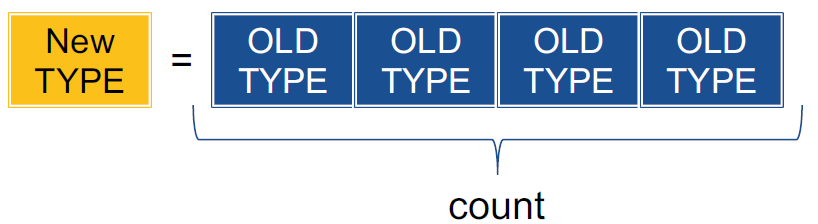

   2. Vector Datatype

      ```c++
      int MPI_Type_vector(int count, int blocklength, int stride, MPI_Datatype oldtype, MPI_Datatype *newtype)
      ```

      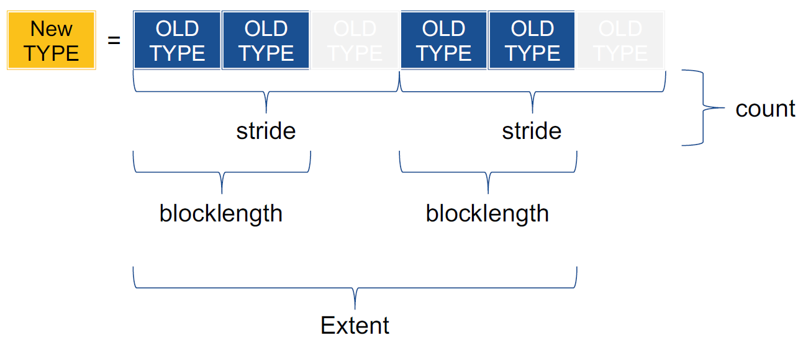

   3. Indexed Datatype

      ```c++
      int MPI_Type_indexed(
         int count,
         const int array_of_blocklengths[],  // (AoB)
         const int array_of_displacements[], // (AoD)
         MPI_Datatype oldtype,
         MPI_Datatype *newtype
      )
      ```

      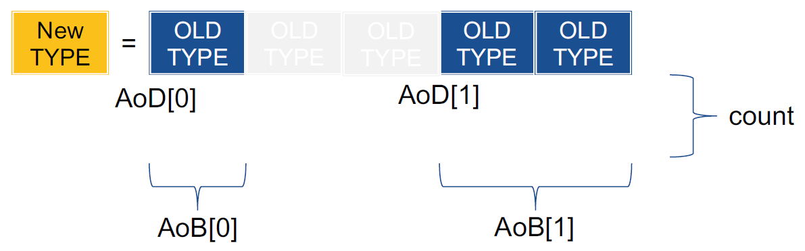

   4. Struct Datatype

      ```c++
      int MPI_Type_create_struct(
         int count,
         const int array_of_blocklengths[],        // (AoB)
         const MPI_Aint array_of_displacements[],  // (AoD)
         const MPI_Datatype array_of_types[],      // (AoT)
         MPI_Datatype *newtype
      )
      ```

      > **Note**: Displacements in Bytes - `MPI_Aint`

      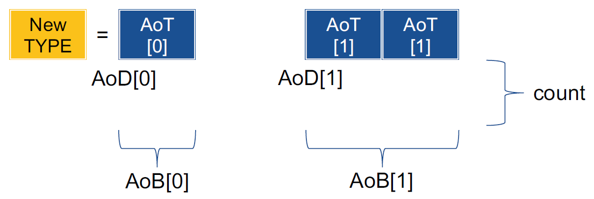

   5. Subarray Datatype

      ```c++
      int MPI_Type_create_subarray(
         int ndims,
         const int array_of_sizes[],
         const int array_of_subsizes[],
         const int array_of_starts[],
         int order,
         MPI_Datatype oldtype, 
         MPI_Datatype *newtype
      )
      ```

      Example: ndims = 2, Sizes = 5,5, Subsizes = 3,2, Starts = 0,1, order = `MPI_ORDER_C`

      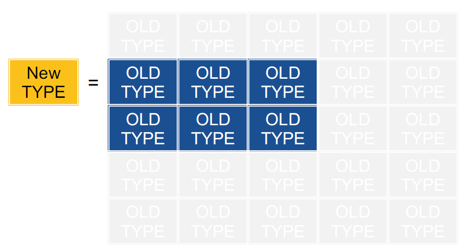

   - Example - `MPI_Type_get_extent`

      ```c++
      #include <stdio.h>
      #include <stdlib.h>
      #include <mpi.h>

      #define INSPECT(dt) { \
         MPI_Type_get_extent(dt, &lb, &ex); \
         printf("%li\n", ex); \
      }

      int main(int argc, char **argv)
      {
         MPI_Datatype dt1[2], dt2, dt3;
         int blens[2];
         MPI_Aint ex, lb, disps[2];

         MPI_Init(&argc, &argv);

         dt1[0] = MPI_DOUBLE;
         INSPECT(dt1[0]);

         dt1[1] = MPI_CHAR;
         INSPECT(dt1[1]);

         blens[0] = 1;
         blens[1] = 2;
         disps[0] = 0;
         disps[1] = sizeof(double);

         MPI_Type_create_struct(2, blens, disps, dt1, &dt2);
         INSPECT(dt2);

         MPI_Type_vector(2, 1, 2, dt2, &dt3);
         INSPECT(dt3);

         MPI_Finalize();

         return 0;
      }
      ```

3. Some other Datatype Construction Functions

   ```c++
   MPI_Type_dup
   // Duplication of datatype
   MPI_Type_create_hvector
   // Like MPI_Type_create_vector only with Byte-sized strides
   MPI_Type_create_hindexed
   // Like MPI_Type_create_indexed only with Byte-sized strides
   MPI_Type_create_indexed_block
   // Like MPI_Type_create_indexed only with fixed block size
   MPI_Type_create_hindexed_block
   // Like MPI_Type_create_indexed_block only with Byte-sized strides
   MPI_Type_create_darray
   // Create a distributed array datatype
   ```

4. Datatype Management

   Datatype handle: `MPI_Datatype`

   Datatype commit

   ```c++
   int MPI_Type_commit(MPI_Datatype *datatype)
   // Necessary before type can be used,
   // But uncommitted types can be used to create new types
   ```

   Datatype free

   ```c++
   int MPI_Type_free(MPI_Datatype *datatype)
   ```

   Adjusting the Extent
  
   ```c++
   int MPI_Type_create_resized(
      MPI_Datatype oldtype, 
      MPI_Aint lb,
      MPI_Aint extent, 
      MPI_Datatype *newtype
   )
   // It's different to MPI_Type_get_extent
   ```

5. When to use datatypes?

   - Messages with multiple datatypes
   - Repeated access to spread out data structures
   - Simplification of code

   Warning
      - Datatype creation/destruction can lead to overhead
      - Not many MPI implementations are optimized for datatypes

### 2. Hybrid Programming (MPI + OpenMP)

1. New MPI Initialization Routine

   ```c++
   // MPI_Init assumes single thread
   int MPI_Init_thread(int *argc, char ***argv, int required, int *provided)
   ```

2. MPI’s Four Levels of Thread Safety

   ```c++
   MPI_THREAD_SINGLE
   // Only one thread exists in the application
   MPI_THREAD_FUNNELED
   // Multithreaded, but only the main thread makes MPI calls
   MPI_THREAD_SERIALIZED
   // Multithreaded, but only one thread at a time makes MPI calls
   MPI_THREAD_MULTIPLE
   // Multithreaded and any thread can make MPI calls at any time
   ```

   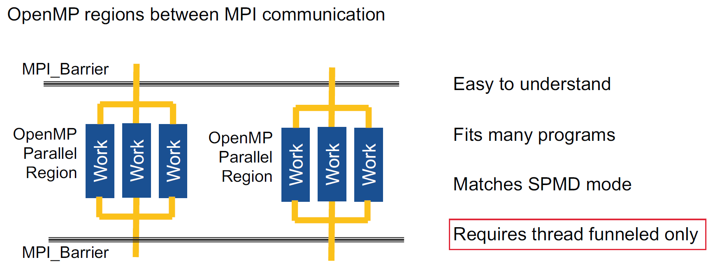
   > Need to split data structures (for MPI), then share data parts (for OpenMP threads).

3. When to Use Hybrid?

   1. Depends on application
      - Sharing requirements and granularity
      - Suitable for hierarchical decomposition?
      - Shared data structures?
      - Impact on portability?
   2. One MPI process per socket often fits well
      - Large degree of parallelism in OpenMP
      - Naturally avoids NUMA problems
      - Need to pin threads to that socket

### 3. Overview of Other Features

1. MPI Process Topologies

   1. Mapping MPI processes to the machine is a hard problem
      - Depends on algorithm and system
      - Often hard to do for programming manually
   2. Topologies define an intuitive name space
      - Simplifies algorithm design
      - Provides MPI with topology information
      - Enables more efficient mappings within MPI
   3. MPI supports
      - Multidimensional grids and tori
      - Arbitrary graphs (careful on how you create the graph!)
   4. Information attached to a communicator
      - Special creation functions
      - Ability to query topologies later on

2. Neighborhood Collectives

   1. Collective operations over neighboring processes using a defined topology
      - E.g., for cartesian topologies attached to communicators, communication with neighbors in coordinate directions
      - Similar options for arbitrary graphs
   2. New sets of routines covering all collective options
      - E.g., `MPI_Neighbor_alltoall`
      - Also as nonblocking variants
      - Another option to do Halo-Exchange

3. Persistence

   1. Persistent Communication (Point to Point) – since MPI 1.0
      - Setup communication once and get a handle (e.g., `MPI_Send_init`)
      - Instead of calling `MPI_Send`, just call `MPI_Start` using handle
      - After that, “normal” **non-blocking** routine
      - In the end, free the resources with `MPI_Request_free`
      - Since MPI 4.0: **Persistent collectives**
   2. Persistent Collectives (and more to come)
      - One-time initialization to pass all arguments, which returns a `request`
      - Use of this request to start communication
      - Completion using `Test/Wait`
      - Reuse request to restart the operation as often as one wants
   3. Benefits
      - Specify repeated operations
      - Ability to lock down resources and to cache execution plan
      - Performance optimization after (small) 1x cost
      - Allows for continuous plan optimization

4. Partitioned Communication

   1. Core idea – efficient highly concurrent communication
      - Built on the concept of persistent P2P communication
      - Send buffers are split into partitions, fill each partition and mark it as ready (good for threads/GPUs)
      - Receive buffers are split into partitions, individual notifications for each arriving partition
      - Enables partial data transfers  
      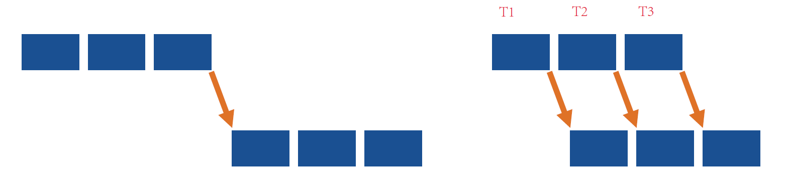

         ```c++
         // Set up the communication
         int MPI_Psend_init(
            const void *buf, 
            int partitions, 
            MPI_Count count, 
            MPI_Datatype datatype,
            int dest, 
            int tag, 
            MPI_Comm comm, 
            MPI_Info info, 
            MPI_Request *request
         );

         // Set up the communication
         int MPI_Precv_init(
            void *buf, 
            int partitions, 
            MPI_Count count, 
            MPI_Datatype datatype,
            int source, 
            int tag, 
            MPI_Comm comm, 
            MPI_Info info, 
            MPI_Request *request
         );

         // Indicate the coming transfers to MPI
         int MPI_Start(
            MPI_Request *request
         );
         //MPI_Startall

         // Indicate that a partition is ready
         int MPI_Pready(
            int partition, 
            MPI_Request request
         );

         // Indicate whether a partition arrived
         int MPI_Parrived(
            MPI_Request request, 
            int partition, 
            int *flag
         );

         // Completes the operation
         MPI_Wait(
            MPI_Request *request, 
            MPI_Status *status
         );
         // MPI_Waitall

         // Free the resources
         int MPI_Request_free(
            MPI_Request *request
         );
         ```

   2. Partitioned Communication + Threading:

      ```c++
      MPI_Psend_init(..., &request);
      for (...) {
         MPI_Start(&request);
         #pragma omp parallel
         {
            kernel(..., request);
         }
         MPI_Wait(&request);
      }
      MPI_Request_free(&request);

      // Thread Kernel
      kernel(..., MPI_Request request) {
         int i = my_partition[my_id];
         /* Compute and fill partition i then mark ready: */
         MPI_Pready(i, request);
      }
      ```

5. Fault Tolerance

6. Other Topics
   1. MPI I/O
   2. Dynamic Process Control
   3. Additional concepts
      1. MPI Sessions to replace MPI_Init
      2. Advanced error handling
      3. Communicator attributes
      4. Generalized requests
      5. MPI_Info objects
      6. One Sided Communication: RMA / Remote Memory Access

### 4. Introduction into RMA (Remote Memory Access)

- One-sided communication
  - Direct memory access to other memories
  - ceiver does not get involved
  - Requires extra synchronization

- Necessary Steps to Use MPI RMA
  - Making memory accessible
  - Reading, writing and updating remote memory
  - Adding needed data synchronization

- RMA performance advantages from low protocol overheads
  - Avoids matching, queueing, buffering, unexpected receives, etc…
  - Especially if supported from underlying interconnect (e.g. InfiniBand). If not, RMA can be really slow

- Differences to models like Pthreads and OpenMP
  - Specific memory regions accessible only
  - Still running in distinct MPI processes, which assume shared nothing
  - No transparent access to remote memory

1. Step 1: Creating Windows

   ```c++
   MPI_WIN_CREATE
   // - Make existing/allocated memory regions remotely accessible
   // - Data addressing relative to base address of window

   MPI_WIN_ALLOCATE
   // - Allocate memory region and make it accessible
   // - Data addressing relative to base address of window

   MPI_WIN_CREATE_DYNAMIC
   // - No buffer yet, but will have one in the future
   // - Additional calls to attach memory to window
   MPI_WIN_ATTACH  // Add memory to a dynamic window
   MPI_WIN_DETACH  // Remove memory from a dynamic window
   // - Data addressing based on absolute address

   MPI_Win_free
   // Free the window and memory
   ```

2. Step 2: Moving Data

   ```c++
   // Read, write and atomically modify data in remotely accessible memory regions.  
   MPI_GET
   MPI_PUT
   MPI_ACCUMULATE
   MPI_GET_ACCUMULATE
   MPI_COMPARE_AND_SWAP
   MPI_FETCH_AND_OP
   // Explicit calls for data transfers. Have to have target/remote memory exposed.
   ```

3. Step 3: Synchronizing

   - MPI RMA data movements are not immideate
      - Can be delayed for efficiency
      - Bound to access epochs and synchronization windows
      - Similar rules on buffer management as for non-blocking operations  
      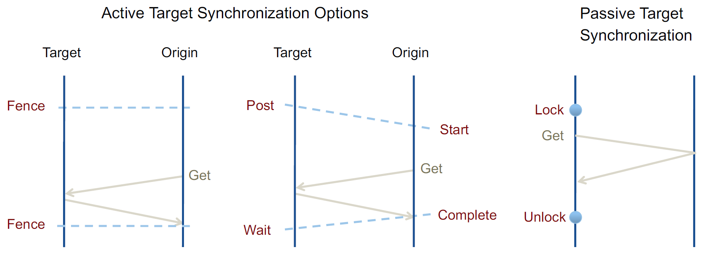

   - Example 1: Active Target Synchronization Options

      ```c++
      #include <mpi.h>

      int main(int argc, char *argv[]) {
         MPI_Init(&argc, &argv);

         int rank, size;
         MPI_Comm_rank(MPI_COMM_WORLD, &rank);
         MPI_Comm_size(MPI_COMM_WORLD, &size);

         int window_data = rank; // Each process will have its rank as window data
         MPI_Win win;

         MPI_Win_create(&window_data, sizeof(int), sizeof(int), MPI_INFO_NULL, MPI_COMM_WORLD, &win);

         if (rank == 0) { // Source process
            int target_rank = 1;
            int data_to_send = 42;
            
            MPI_Win_start(MPI_GROUP_EMPTY, 0, win);
            MPI_Put(&data_to_send, 1, MPI_INT, target_rank, 0, 1, MPI_INT, win);
            MPI_Win_complete(win);
         } else if (rank == 1) { // Target process
            MPI_Win_post(MPI_GROUP_EMPTY, 0, win);
            MPI_Win_wait(win);

            printf("Process %d received data: %d\n", rank, window_data);
         }

         MPI_Win_free(&win);
         MPI_Finalize();
         return 0;
      }
      ```

   - Example 2: Passive Target Synchronization

      ```c++
      #include <mpi.h>
      #include <stdio.h>

      int main(int argc, char *argv[]) {
         MPI_Init(&argc, &argv);

         int rank, size;
         MPI_Comm_rank(MPI_COMM_WORLD, &rank);
         MPI_Comm_size(MPI_COMM_WORLD, &size);

         // Each process has an integer window data
         int window_data = rank; // Initial value is the rank of the process
         MPI_Win win;

         // Create a window, with size of each window being sizeof(int)
         MPI_Win_create(&window_data, sizeof(int), sizeof(int), MPI_INFO_NULL, MPI_COMM_WORLD, &win);

         if (rank == 0) { // Source process
            int target_rank = 1;
            int data_to_send = 42;

            // Lock the target process's window
            MPI_Win_lock(MPI_LOCK_EXCLUSIVE, target_rank, 0, win);

            // Put data into the target process's window
            MPI_Put(&data_to_send, 1, MPI_INT, target_rank, 0, 1, MPI_INT, win);

            // Unlock the target process's window
            MPI_Win_unlock(target_rank, win);
         } else if (rank == 1) { // Target process
            // Lock its own window to ensure the source process's write is completed
            MPI_Win_lock(MPI_LOCK_SHARED, rank, 0, win);

            // Print the received data
            printf("Process %d received data: %d\n", rank, window_data);

            // Unlock its own window
            MPI_Win_unlock(rank, win);
         }

         // Free the window
         MPI_Win_free(&win);
         MPI_Finalize();
         return 0;
      }
      ```

4. Shared Memory in MPI

   ```c++
   // Create an MPI window that is also accessible with local load/store operations
   int MPI_Win_allocate_shared(
      MPI_Aint size, 
      int disp_unit,
      MPI_Info info, 
      MPI_Comm comm,
      void *baseptr, 
      MPI_Win *win
   )
   // Use cases: Large read-only tables, often used in Equations of State (EoS)
   ```

5. Shared Memory Subcommunicators

   ```c++
   int MPI_Comm_split_type(
      MPI_Comm parent_comm, 
      int split_type, 
      int key, 
      MPI_Comm *new_comm
   )
   // MPI_COMM_TYPE_SHARED or Options for HW topology detection
   ```

### Exercise - MPI Hybrid

1. Thread Binding / Thread Affinity
   - OpenMP
      1. `OMP_PLACES = cores`
      2. `OMP_PROC_BIND = true`
      3. `# pragma omp parallel for proc_bind(close)`
      - Environment variables control initial OpenMP thread binding policies
      - OMP_PROC_BIND must be set for thread binding to take effect
      - OMP_PROC_BIND might be automatically set when other related environment variables are set
      - OMP_PROC_BIND can be just set to true or specify a default policy (master, close, spread)
      - [Policy Details](https://www.openmp.org/spec-html/5.0/openmpsu36.html)
   - OpenMPI
      1. `mpirun --rank-by object --map-by object --bind-to object`
      - MPI thread affinity is controlled by the MPI process launcher (e.g. `mpirun`)
      - MPI ranks can be bound to a number of objects (`thread`, `core`, `socket`, `numa`, etc.) or a range of objects (`socket:PE=4`)

2. Thread Binding - Debugging
   - OpenMP
      1. `OMP_DISPLAY_ENV = verbose`
      2. `OMP_DISPLAY_AFFINITY = true`
      - Enables environment debug output including places and binding policy
   - MPI
      1. Default: `mpirun -np 4 --report-bindings ./executable`
      2. Map by core: `mpirun -np 4 --map-by core --bind-to core --report-bindings ./executable`
      3. Four cores per socket: `mpirun -np 4 --map-by socket:PE=4 --bind-to core --report-bindings ./executable`
      - Prints a thread binding report for each rank before execution

3. Makefile and env

## 11. GPUs

### 1. Trend Towards Accelerators

- Small form factor
  1. GPU
  2. FPGA
  3. Dataflow engine
- Large form factor: Special architectures for AI
- Future: Quantum Acceleration

### 2. Concepts of a GPU

- Key concept: vector / SIMD processing
  - Massively parallel processing in a single chip
- Advantages:
  - Reduces complexity of the processor
  - Increases energy efficiency
- Disadvantages
  - Reduced flexibility (must vectorize problem)
  - Additional programming complexity
- Architectural Diagram

### 3. Introduction into CUDA

- How to program accelerators
  1. Definition and programming of a kernel
  2. Setting up a data environment
  3. Dispatching a kernel
  4. Synchronization
  5. Collect results
- Common Options: CUDA, OpenCL, OpenMP, OpenACC, SYCL
- CUDA programs (host and kernel) are compiled with a separate compiler `nvcc`

1. Code and Data for the GPU

    ```c++
    //Functions can run on the host or the device (GPU)
    //Prefix for functions

    __global__
    // Kernels to be executed on the GPU
    // Kernels are configurable

    __device__
    // GPU functions that can be called from within kernels

    __host__  // (also default)
    // Functions for the CPU

    //Variables declared in __device__ or __global__ functions are allocated to the GPU memory accessible by all processors in the GPU.
    ```

2. Kernel Invocation

    ```c++
    // Function call syntax for the GPU
    kernel_func_name<<<dimGrid, dimBlock>>>(… parameter list…)
    // Dim3 dimGrid number of thread blocks (x, y, z)
    // Dim3 dimBlock number of threads per block (x, y, z)

    // Inside of a function the following variables are available for querying
    blockIdx.x  // (.y, .z)   // index of the thread block
    blockDim.x  // (.y, .z)   // dimension of the thread block
    threadIdx.x  // (.y, .z)  // id of a thread in a block
    ```

    Example:

    ```c++
    // Monolithic Kernel
    __global__
    void daxpy(int n, double a, double *x, double *y) {
        int i = blockIdx.x * blockDim.x + threadIdx.x;
        if (i < n) y[i] = a * x[i] + y[i];
    }

    // Copy data to device
    cudaMalloc(&d_x, nbytes);
    cudaMalloc(&d_y, nbytes);
    cudaMemcpy(d_x, h_x, nbytes, cudaMemcpyHostToDevice);
    cudaMemcpy(d_y, h_y, nbytes, cudaMemcpyHostToDevice);

    // Invoke DAXPY with 256 threads per Thread Block
    int nblocks = (n + 255) / 256;
    daxpy<<<nblocks, 256>>>(n, 2.0, d_x, d_y);

    // Copy data from device
    cudaMemcpy(h_y, d_y, nbytes, cudaMemcpyDeviceToHost);

    // Free device memory
    cudaFree(d_x);
    cudaFree(d_y);
    ```

3. Host Synchronization

    - All kernel launches are asynchronous
       1. Control returns to CPU immediately
       2. Kernel executes after all previous CUDA calls have completed

        ```c++
        cudaMemcopy() // is synchronous
        // Control returns to CPU after copy completes
        // Copy starts after all previous CUDA calls have completed

        cudaThreadSynchronize()
        // Blocks until all previous CUDA calls complete

        cudaDeviceSynchronize()
        // Blocks until all calls on all CUDA devices are completed
        ```

    - Asynchrony Rules in CUDA
        - All CUDA kernel invocations are asynchronous
            1. Kernel just scheduled on GPU
            2. CPU continues executing
            3. Synchronization through explicit sync routines or synchronizing MemCopy  
            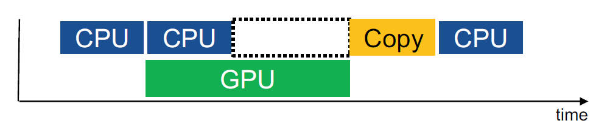
        - Multiple kernel invocations serialize by default
            1. Each kernel waiting on the completion of the previous one
            2. Synchronizing MemCopy waiting on all kernel2  
            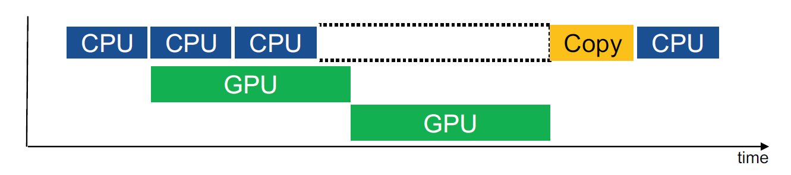

4. CUDA Streams

    Streams represents queues for kernel execution
    - Host CPU code places work into the stream/queue and continues
    - GPU schedules kernels from queue when resources are free

    Overlapping
    - Operations within the same stream are ordered (FIFO) and cannot overlap
    - Operations in different streams are unordered and can overlap

    Stream Management

    ```c++
    cudaStream_t stream;  
    // Declares a stream handle

    cudaStreamCreate(&stream);  
    // Allocates a stream

    cudaStreamDestroy(stream);  
    // Deallocates a stream
    // Synchronizes host until work in stream has completed
                                
    kernel_func_name<<blocks, threads, size, stream>>(<params>)
    // Kernel invocation on particular stream
    ```

    CUDA Stream Example

    ```c++
    // Starting two kernels
    foo<<blocks,threads>>();
    foo<<blocks,threads>>();
    ```

    

    ```c++
    // Starting two kernels on two streams
    cudaStream_t stream1, stream2;
    cudaStreamCreate(&stream1);
    cudaStreamCreate(&stream2);

    foo<<blocks,threads,0,stream1>>();
    foo<<blocks,threads,0,stream2>>();

    cudaStreamDestroy(stream1);
    cudaStreamDestroy(stream2);
    ```

    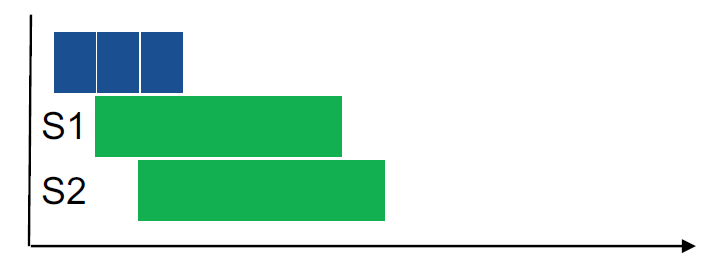

    ```c++
    // Starting two kernels with one extra stream
    cudaStream_t stream;
    cudaStreamCreate(&stream);

    foo<<blocks,threads>>();
    foo<<blocks,threads,0,stream>>();

    cudaStreamDestroy(stream);
    ```

    > Stream 0 is the default stream.  
    > Stream is synchronizing to all streams.

    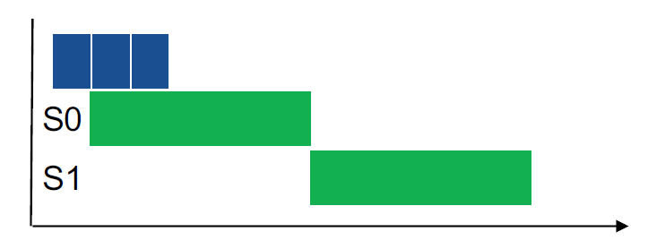

5. Per Stream Memory Copies

    ```c++
    // Synchronizing MemCopy (synchronizes to stream 0)
    cudaMemcpy (void* d, void* s, size_t c, cudaMemcpyKind kind)

    // Async MemCopy
    cudaMemcpyAsync (void* d, void* s, size_t c,
                    cudaMemcpyKind kind,
                    cudaStream_t stream = 0 )

    // Async copy requires pinned host memory
    // • Memory not pageable, i.e., can be safely transferred at any time
    // • Special allocation/deallocation calls
    cudaMallocHost(...)
    cudaHostAlloc(...)
    cudaFreeHost(...)
    // • Calls to pin/unpin memory
    cudaHostRegister(...) / cudaHostUnregister(...)
    ```

    Streams Can Also Help Transfer Concurrency

    1. Synchronous

        ```c++
        cudaMemcpy(...);
        foo<<...>>();
        ```

        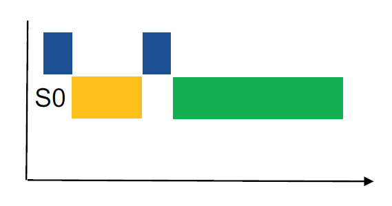

    2. Asynchronous Same Stream

        ```c++
        cudaMemcpyAsync(..., stream1);
        foo<<..., stream1>>();
        ```

        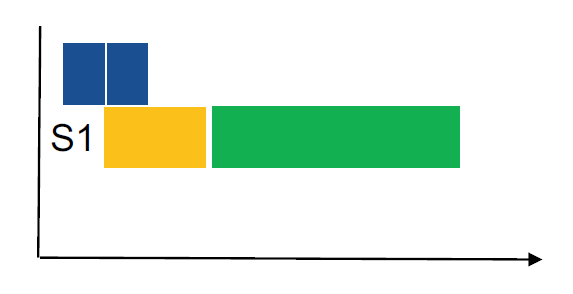

    3. Asynchronous Different Streams

        ```c++
        cudaMemcpyAsync(..., stream1);
        foo<<..., stream2>>();
        ```

        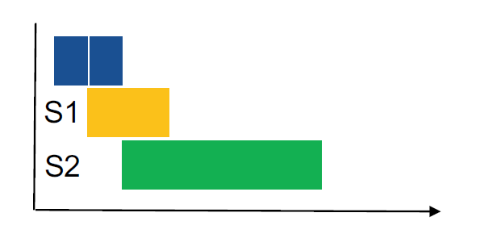

6. Advanced CUDA Synchronization Topics

    Explicit Synchronization

    ```c++
    cudaDeviceSynchronize()  // Synchronize everything
    cudaStreamSynchronize(stream)  // Synchronize one stream
    // Synchronize using events -> look it up
    ```

    Stream Priorities

    ```c++
    // High priority streams will preempt lower priority streams
    // Lower number is higher priority
    cudaDeviceGetStreamPriorityRange(&low, &high)

    // Create using special API
    cudaStreamCreateWithPriority(&stream, flags, priority)
    ```

    Stream Callbacks
    - Registration of host side callbacks with respect to a stream
    - Invocation when tasks in the stream are complete

    Direct Assembler: PTX Assembler code can be embedded into CUDA-C code

### 4. OpenMP Target

1. Target directive

    Creates a device data environment: Executes the target region (structured-block) on the specificed device.  
    Synchronous: The encountering threads waits until the device finished.
  
    ```c++
    #pragma omp target device(0)
        // Structured-block
    ```

2. Target directive with Data Enviroment

    Variables referenced in target region:
    - Either are declared in the region
    - Or have to be explicitly added to the data environment

    ```c++
    // Map clause: to, from, fromTo(default) 
    #pragma omp target device(0), map(to:x,y)
        // Structured-block
    ```

3. Explicit Data Enviroment

    Defines the data environment on a device

    ```c++
    #pragma omp target data device(0) map(to:x,y)
        // Structured-block
    ```

    Update corresponding or original variable

    ```c++
    #pragma omp target update device(0) map(to:x,y)
        // Structured-block
    ```

4. Asynchronous Execution

   The nowait clause allows the host thread to continue executing other tasks without blocking while the target device is performing an operation.

   ```c++
   #pragma omp target map(dist, x1, y1, x2, y2) nowait
   {
      dist = sqrt((x2 - x1)*(x2 - x1) + (y2 - y1)*(y2 - y1));
   }
   ```

5. Declare Variables and Functions for Target

    Specifies (static) variables and functions to be mapped to a device

    ```c++
    #pragma omp declare target
        // block of definitions
    #pragma omp end declare target
    ```

   Example

    ```c++
    #pragma omp declare target
    void daxpy(int n, double a, double *x, double *y) {
        #pragma omp parallel for
        for (int i = 0; i < n; ++i) {
            y[i] = a * x[i] + y[i];
        }
    }
    #pragma omp end declare target

    // ...

    #pragma omp target map(to: x, y) map(from: y)
    daxpy(n, 2.0, x, y);
    ```

### 5. Beyond the Single GPU or Accelerator

### Exercise - Advanced MPI Features

1. Double-buffering and Look-ahead

    ```c++
    get_next_input(0, input);

    // Distribute data
    MPI_Scatter(input, input_size, MPI_FLOAT, compute_buf, elems_per_rank, 0, MPI_COMM_WORLD);

    for (int s = 0; s < num_steps - 1; s++) {
        get_next_input(s + 1, input);

        // Distribute data
        MPI_Iscatter(input, input_size, MPI_FLOAT, comm_buf, elems_per_rank, 0, MPI_COMM_WORLD, &request);

        compute(compute_buf, elems_per_rank);

        MPI_Wait(&request, MPI_STATUS_IGNORE);

        MPI_Reduce(compute_buf, elems_per_rank, MPI_FLOAT, reduce_op, 0, MPI_COMM_WORLD);

        write_result(compute_buf);

        swap(&comm_buf, &compute_buf);
    }

    compute(compute_buf, elems_per_rank);

    MPI_Reduce(compute_buf, elems_per_rank, MPI_FLOAT, reduce_op, 0, MPI_COMM_WORLD);

    write_result(compute_buf);
    ```

    Blocking version

    ```c++
    for (int s = 0; s < num_steps; s++) {
        get_input(s, input);

        // Distribute data
        MPI_Scatter(input, input_size, MPI_FLOAT, compute_buf, elems_per_rank, 0, MPI_COMM_WORLD);

        compute(compute_buf, elems_per_rank);

        MPI_Reduce(compute_buf, elems_per_rank, MPI_FLOAT, reduce_op, 0, MPI_COMM_WORLD);

        write_result(compute_buf);
    }
    ```

2. Partitioned Communication

    Two ranks that do a parallel computation using OpenMP  

    1. Sender Side - Each thread in rank 0 computes one partition

        ```c++
        int num_threads = omp_get_max_threads();
        
        if (rank == 0) {
            MPI_Psend_init(sendbuf, num_threads, arraysize, MPI_DOUBLE, 1, 0, MPI_COMM_WORLD, MPI_INFO_NULL, &request);

            for (int k = 0; k < num_steps; k++) {
                MPI_Start(&request);

                #pragma omp parallel
                {
                    int i = omp_get_thread_num();
                    // Do computation on i-th block of data
                    MPI_Pready(i, &request);
                }

                MPI_Wait(&request);
            }

            MPI_Request_free(&request);
        } else if (rank == 1) {
            // ... 
        }
        ```

    2. Receiver Side - Each thread in rank 1 waits for a partition, then does some computation on the data

        ```c++
        if (rank == 0) {
            // ...
        } else if (rank == 1) {
            MPI_Precv_init(recvbuf, num_threads, arraysize, MPI_DOUBLE, 0, 0, MPI_COMM_WORLD, MPI_INFO_NULL, &request);

            for (int k = 0; k < num_steps; k++) {
                MPI_Start(&request);

                #pragma omp parallel
                {
                    int i = omp_get_thread_num();
                    int flag = false;

                    // Do stuff
                    while (!flag) {
                        // Do more stuff
                        MPI_Parrived(request, i, &flag);
                    }

                    // Do computation on i-th block of data
                }

                MPI_Wait(&request);
            }

            MPI_Request_free(&request);
        }
        ```

3. CUDA-Aware MPI  

- MPI library can directly access GPU memory  
- Application simply passes pointer to GPU memory
- Applications can dynamically query support for accelerator memory - `mpi_memory_alloc_kinds`

## 12. Other Models

### 1. Partitioned Global Address Space

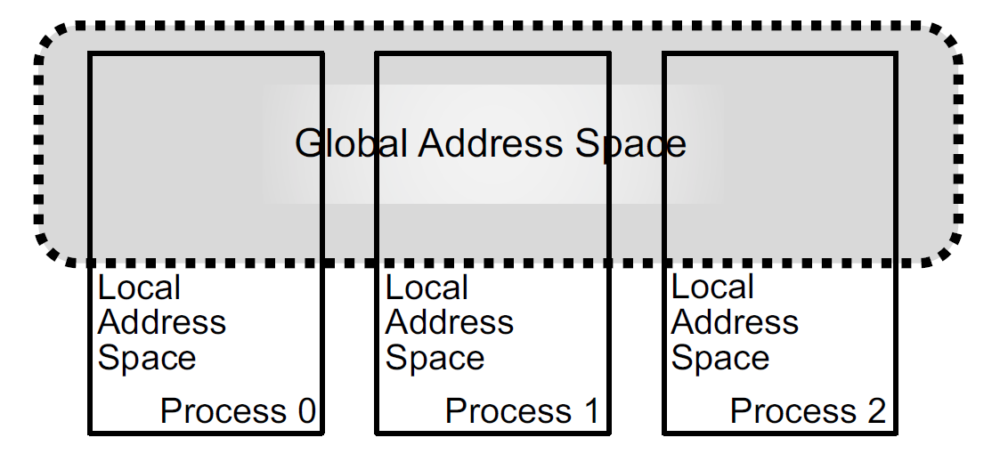

1. Any thread/process may directly read/write data allocated by another
2. Partitioned
Data is designated as local or global

Example: UPC

```c++
#define SIZE 4*THREADS

int main()
{
    int i;
    shared int A[SIZE];
    
    upc_forall(i = 0; i < SIZE; i++; &A[i])  // &A[i]: Affinity Expression
    {
        A[i] = MYTHREAD;
    }
    
    upc_barrier;
    
    if (MYTHREAD == 0)
    {
        for (i = 0; i < SIZE; i++)
        {
            printf("%d ", A[i]);  // Local & Remote Reads from A
        }
        printf("\n");
    }
    
    return 0;
}
```

PGAS Pros & Cons:  

1. Advantages of PGAS
   - Low latency memory access operations instead of two sided messaging
   - Direct mapping of global data structures
2. Disadvantages of PGAS
   - All the baggage of shared memory, incl. synchronization and possible races
   - Harder to optimize
   - Global memory accesses have larger latencies
   - Only two hierarchy levels

### 2. Fine-grained Tasking

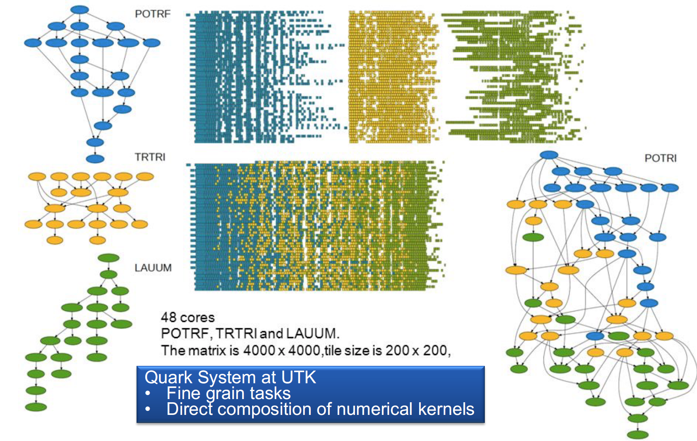

Critical Paths:

 1. Only relevant metric
    - Length of critical path
    - Longest dependency list between tasks in system
 2. Consequences
    - Dictates performance
    - Focus performance optimization on this path

Two Task-Based Examples:

1. Charm++
2. Legion

### 3. Example: Charm++

Charm++ is a way of parallel programming, it is based on:

- Objects
- Overdecomposition
- Asynchrony
- Migratability
- Adaptive runtime system

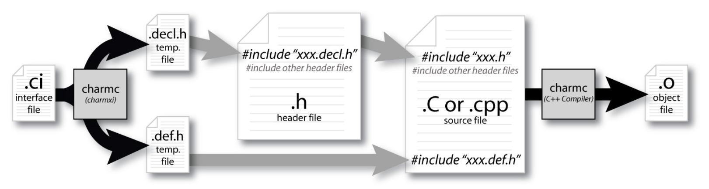

Example: Fibonacci

```c++
// .ci file
mainmodule fib {
  readonly int n;

  mainchare Main {
    entry Main(CkArgMsg* m);
    entry void done();
  };

  chare Fib {
    entry Fib(int n, bool is_root, CProxy_Fib parent);
    
    entry void calc(int n) {
      if (n < THRESHOLD)
        serial { respond(seqFib(n)); }
      else {
        serial {
          CProxy_Fib::ckNew(n - 1, false, thisProxy);
          CProxy_Fib::ckNew(n - 2, false, thisProxy);
        }
        when response(int val)
        when response(int val2)
        serial { respond(val + val2); }
      }
    };

    entry void response(int val);
  };
};
```

```c++
// cpp file
#include "fib.decl.h"
#define THRESHOLD 3 // calculate sequentially if below

/* readonly */ int n; // fibonacci number
/* readonly */ CProxy_Main mainProxy;

class Main : public CBase_Main {
  double start_time;
public:
  Main(CkArgMsg* m) {
    // determine fibonacci number
    n = 20;
    if (m->argc == 2)
      n = atoi(m->argv[1]);
    CkPrintf("\n[Exercise 1. Fibonacci Sequence]\n");
    // create chares and start computation
    start_time = CkWallTimer();
    CProxy_Fib::ckNew(n, true, CProxy_Fib());
  }

  void done() {
    CkPrintf("Elapsed time: %lf seconds\n\n", CkWallTimer() - start_time);
    CkExit();
  }
};

class Fib : public CBase_Fib {
  Fib_SDAG_CODE
  CProxy_Fib parent;
  bool is_root;
public:
  Fib(int n, bool is_root_, CProxy_Fib parent_)
    : parent(parent_), is_root(is_root_) {
    thisProxy.calc(n);
  }

  int seqFib(int n) {
    return (n < 2) ? n : seqFib(n - 1) + seqFib(n - 2);
  }

  void respond(int val) {
    if (!is_root) {
      parent.response(val);
      delete this;
    } else {
      CkPrintf("Fibonacci number is: %d\n", val);
      mainProxy.done();
    }
  }
};

#include "fib.def.h"
```

### 4. Example: Legion

Example: Fibonacci

```c++
#include <cstdio>
#include <cassert>
#include <cstdlib>
#include "legion.h"

using namespace Legion;

enum TaskIDs {
  TOP_LEVEL_TASK_ID,
  FIBONACCI_TASK_ID,
  SUM_TASK_ID,
};

int main(int argc, char **argv) {
  Runtime::set_top_level_task_id(TOP_LEVEL_TASK_ID);
  {
    TaskVariantRegistrar registrar(TOP_LEVEL_TASK_ID, "top_level");
    registrar.add_constraint(ProcessorConstraint(Processor::LOC_PROC));
    Runtime::preregister_task_variant<top_level_task>(registrar, "top_level");
  }
  {
    TaskVariantRegistrar registrar(FIBONACCI_TASK_ID, "fibonacci");
    registrar.add_constraint(ProcessorConstraint(Processor::LOC_PROC));
    Runtime::preregister_task_variant<int, fibonacci_task>(registrar, "fibonacci");
  }
  {
    TaskVariantRegistrar registrar(SUM_TASK_ID, "sum");
    registrar.add_constraint(ProcessorConstraint(Processor::LOC_PROC));
    registrar.set_leaf(true);
    Runtime::preregister_task_variant<int, sum_task>(registrar, "sum", AUTO_GENERATE_ID);
  }
  return Runtime::start(argc, argv);
}

void top_level_task(const Task *task, const std::vector<PhysicalRegion> &regions, Context ctx, Runtime *runtime) {
  int num_fibonacci = 7; // Default value
  const InputArgs &command_args = Runtime::get_input_args();
  for (int i = 1; i < command_args.argc; i++) {
    // Skip any legion runtime configuration parameters
    if (command_args.argv[i][0] == '-') { 
      i++; 
      continue; 
    }
    num_fibonacci = atoi(command_args.argv[i]);
    break;
  }
  printf("Computing the first %d Fibonacci numbers...\n", num_fibonacci);
  std::vector<Future> fib_results;
  for (int i = 0; i < num_fibonacci; i++) {
    TaskLauncher launcher(FIBONACCI_TASK_ID, TaskArgument(&i, sizeof(i)));
    fib_results.push_back(runtime->execute_task(ctx, launcher));
  }
  for (int i = 0; i < num_fibonacci; i++) {
    int result = fib_results[i].get_result<int>();
    printf("Fibonacci(%d) = %d\n", i, result);
  }
  fib_results.clear();
}

int fibonacci_task(const Task *task, const std::vector<PhysicalRegion> &regions, Context ctx, Runtime *runtime) {
  assert(task->arglen == sizeof(int));
  int fib_num = *(const int*)task->args;
  if (fib_num == 0) return 0;
  if (fib_num == 1) return 1;

  // Launch fib-1
  const int fib1 = fib_num - 1;
  TaskLauncher t1(FIBONACCI_TASK_ID, TaskArgument(&fib1, sizeof(fib1)));
  Future f1 = runtime->execute_task(ctx, t1);

  // Launch fib-2
  const int fib2 = fib_num - 2;
  TaskLauncher t2(FIBONACCI_TASK_ID, TaskArgument(&fib2, sizeof(fib2)));
  Future f2 = runtime->execute_task(ctx, t2);

  TaskLauncher sum(SUM_TASK_ID, TaskArgument(NULL, 0));
  sum.add_future(f1);
  sum.add_future(f2);
  Future result = runtime->execute_task(ctx, sum);
  return result.get_result<int>();
}

int sum_task(const Task *task, const std::vector<PhysicalRegion> &regions, Context ctx, Runtime *runtime) {
  assert(task->futures.size() == 2);
  Future f1 = task->futures[0];
  int r1 = f1.get_result<int>();
  Future f2 = task->futures[1];
  int r2 = f2.get_result<int>();
  return (r1 + r2);
}
```

### 5. Wrap-Up

### Exercise - Recap
